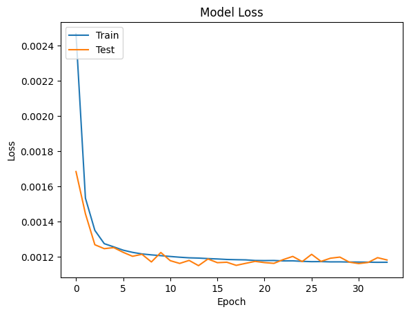
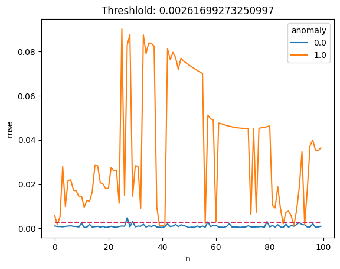

```python
# 이 Lab 시나리오는 크레딧 카드 이상거래 탐지에 autoencoder 모델, 벡터쿼리를 사용하여 사기거래 탐지를 다루는 샘플임.
# 여기서는 csv데이터에서 데이터프레임을 활용한 데이터 생성, 학습 및 테스트 데이터 분류 및 scaling을 다룸.
# 아울러 autoencoder 모델를 만들고 학습, 테스트 및 모델 저장을 다룸.

# keras, oracle23ai를 기반으로함.
# python & pip 라이브러리 임포트.

import matplotlib.pyplot as plt
import pandas as pd
import numpy as np
import keras
from sklearn import datasets, decomposition, preprocessing, model_selection
from sklearn.model_selection import train_test_split
from keras import layers, activations, losses, optimizers, metrics, models
from tensorflow.keras.layers import Dense
from keras.callbacks import EarlyStopping
from keras.models import load_model, save_model

print("complete libries loading")
```

    2024-12-30 08:43:22.485209: E external/local_xla/xla/stream_executor/cuda/cuda_fft.cc:485] Unable to register cuFFT factory: Attempting to register factory for plugin cuFFT when one has already been registered
    2024-12-30 08:43:22.497915: E external/local_xla/xla/stream_executor/cuda/cuda_dnn.cc:8454] Unable to register cuDNN factory: Attempting to register factory for plugin cuDNN when one has already been registered
    2024-12-30 08:43:22.501784: E external/local_xla/xla/stream_executor/cuda/cuda_blas.cc:1452] Unable to register cuBLAS factory: Attempting to register factory for plugin cuBLAS when one has already been registered
    2024-12-30 08:43:22.511485: I tensorflow/core/platform/cpu_feature_guard.cc:210] This TensorFlow binary is optimized to use available CPU instructions in performance-critical operations.
    To enable the following instructions: AVX2 FMA, in other operations, rebuild TensorFlow with the appropriate compiler flags.
    2024-12-30 08:43:23.282460: W tensorflow/compiler/tf2tensorrt/utils/py_utils.cc:38] TF-TRT Warning: Could not find TensorRT


    complete libries loading


```python
# csv 데이터를 pandas 데이터 프레임으로 로딩
# normal 이벤트 셋과 abnormal 이벤트 셋으로 분리

data = pd.read_csv('/home/dev01/labs/autoencoder/creditcard/input/creditcard.csv', engine='python', sep = ',', decimal = '.', parse_dates=True)

x = data[data.columns[1:30]]
#print(x)
x = x.to_numpy()
y = data[data.columns[30]].to_numpy()
data = pd.concat([pd.DataFrame(x), pd.DataFrame({'anomaly': y})], axis=1)
#data.info()

normal = data[data['anomaly'] == 0]
fraud = data[data['anomaly'] == 1]

normal_events = normal.loc[:, normal.columns != 'anomaly']
print(normal_events)
abnormal_events = fraud.loc[:, fraud.columns != 'anomaly']

print("normal 이벤트 데이터 셋",normal_events.shape, "abnormal 이벤트 데이터셋",abnormal_events.shape)

#print("Normal_Rows:",len(normal_events), "Fraud_Rows:",len(abnormal_events))
```

                   0          1         2         3         4         5   \
    0       -1.359807  -0.072781  2.536347  1.378155 -0.338321  0.462388   
    1        1.191857   0.266151  0.166480  0.448154  0.060018 -0.082361   
    2       -1.358354  -1.340163  1.773209  0.379780 -0.503198  1.800499   
    3       -0.966272  -0.185226  1.792993 -0.863291 -0.010309  1.247203   
    4       -1.158233   0.877737  1.548718  0.403034 -0.407193  0.095921   
    ...           ...        ...       ...       ...       ...       ...   
    284802 -11.881118  10.071785 -9.834783 -2.066656 -5.364473 -2.606837   
    284803  -0.732789  -0.055080  2.035030 -0.738589  0.868229  1.058415   
    284804   1.919565  -0.301254 -3.249640 -0.557828  2.630515  3.031260   
    284805  -0.240440   0.530483  0.702510  0.689799 -0.377961  0.623708   
    284806  -0.533413  -0.189733  0.703337 -0.506271 -0.012546 -0.649617   
    
                  6         7         8         9   ...        19        20  \
    0       0.239599  0.098698  0.363787  0.090794  ...  0.251412 -0.018307   
    1      -0.078803  0.085102 -0.255425 -0.166974  ... -0.069083 -0.225775   
    2       0.791461  0.247676 -1.514654  0.207643  ...  0.524980  0.247998   
    3       0.237609  0.377436 -1.387024 -0.054952  ... -0.208038 -0.108300   
    4       0.592941 -0.270533  0.817739  0.753074  ...  0.408542 -0.009431   
    ...          ...       ...       ...       ...  ...       ...       ...   
    284802 -4.918215  7.305334  1.914428  4.356170  ...  1.475829  0.213454   
    284803  0.024330  0.294869  0.584800 -0.975926  ...  0.059616  0.214205   
    284804 -0.296827  0.708417  0.432454 -0.484782  ...  0.001396  0.232045   
    284805 -0.686180  0.679145  0.392087 -0.399126  ...  0.127434  0.265245   
    284806  1.577006 -0.414650  0.486180 -0.915427  ...  0.382948  0.261057   
    
                  21        22        23        24        25        26        27  \
    0       0.277838 -0.110474  0.066928  0.128539 -0.189115  0.133558 -0.021053   
    1      -0.638672  0.101288 -0.339846  0.167170  0.125895 -0.008983  0.014724   
    2       0.771679  0.909412 -0.689281 -0.327642 -0.139097 -0.055353 -0.059752   
    3       0.005274 -0.190321 -1.175575  0.647376 -0.221929  0.062723  0.061458   
    4       0.798278 -0.137458  0.141267 -0.206010  0.502292  0.219422  0.215153   
    ...          ...       ...       ...       ...       ...       ...       ...   
    284802  0.111864  1.014480 -0.509348  1.436807  0.250034  0.943651  0.823731   
    284803  0.924384  0.012463 -1.016226 -0.606624 -0.395255  0.068472 -0.053527   
    284804  0.578229 -0.037501  0.640134  0.265745 -0.087371  0.004455 -0.026561   
    284805  0.800049 -0.163298  0.123205 -0.569159  0.546668  0.108821  0.104533   
    284806  0.643078  0.376777  0.008797 -0.473649 -0.818267 -0.002415  0.013649   
    
                28  
    0       149.62  
    1         2.69  
    2       378.66  
    3       123.50  
    4        69.99  
    ...        ...  
    284802    0.77  
    284803   24.79  
    284804   67.88  
    284805   10.00  
    284806  217.00  
    
    [284315 rows x 29 columns]
    normal 이벤트 데이터 셋 (284315, 29) abnormal 이벤트 데이터셋 (492, 29)


```python
# 데이터 셋 scaling
# scaling은 데디터 전처리 과정중 하나임.
# 피처들의 데이터 값의 범위가 클 경우 모델 학습때 0으로 수렴되더나 무한 발산 현상을 예방함. 

scaler = preprocessing.MinMaxScaler()

# anomaly 컬럼값 제외하여 스케일링할 것임.

#scaler.fit(data.drop(labels='anomaly', axis=1))
scaler.fit(normal_events)

# 학습 데이터는 "normal events" 만으로 학습을 진행할 것임.
scaled_data = scaler.transform(normal_events)
print("Sacled Data: ", scaled_data.shape)

# 모델 훈련용 데이터셋, 테스트 데이터 셋 준비
# 스케일된 데이터 셋중 80는 모델 학습용, 나머지는 테스트용으로 준비

train_data, test_data = model_selection.train_test_split(scaled_data, test_size=0.2)
print("Training data:", train_data.shape, "Testing data:", test_data.shape)

# autoencoder 모델 입력 shape 지정
n_features = scaled_data.shape[1]

print("n_features:",n_features)
print("Ready for train & test data")
```

    Sacled Data:  (284315, 29)
    Training data: (227452, 29) Testing data: (56863, 29)
    n_features: 29
    Ready for train & test data


```python
# autoencoder 모델 생성.
# 모델명 : CardFraudDector
# from keras import models, layers, activations, losses, optimizers, metrics

encoder = models.Sequential(name='encoder')
encoder.add(layer=layers.Dense(units=20, activation=activations.relu, input_shape=[n_features]))
encoder.add(layers.Dropout(0.1))
encoder.add(layer=layers.Dense(units=10, activation=activations.relu))
encoder.add(layer=layers.Dense(units=5, activation=activations.relu))
decoder = models.Sequential(name='decoder')
decoder.add(layer=layers.Dense(units=10, activation=activations.relu, input_shape=[5]))
decoder.add(layer=layers.Dense(units=20, activation=activations.relu))
decoder.add(layers.Dropout(0.1))
decoder.add(layer=layers.Dense(units=n_features, activation=activations.sigmoid))
CardFraudDector = models.Sequential([encoder, decoder])

# 모델 컴파일.
# 사용 옵티마이저 : Adam
# mean_squared_error(MSE)는 실제값과 예측값의 차이를 제곱해 평균화한 것으로 특이값이 있으면 수치가 늘어남.

CardFraudDector.compile(optimizer=optimizers.Adam(), loss="mse", metrics=[metrics.mean_squared_error])
CardFraudDector.summary()
```

    /home/dev01/Python-3.12.1/lib/python3.12/site-packages/keras/src/layers/core/dense.py:87: UserWarning: Do not pass an `input_shape`/`input_dim` argument to a layer. When using Sequential models, prefer using an `Input(shape)` object as the first layer in the model instead.
      super().__init__(activity_regularizer=activity_regularizer, **kwargs)


<pre style="white-space:pre;overflow-x:auto;line-height:normal;font-family:Menlo,'DejaVu Sans Mono',consolas,'Courier New',monospace"><span style="font-weight: bold">Model: "sequential"</span>
</pre>


<pre style="white-space:pre;overflow-x:auto;line-height:normal;font-family:Menlo,'DejaVu Sans Mono',consolas,'Courier New',monospace">┏━━━━━━━━━━━━━━━━━━━━━━━━━━━━━━━━━┳━━━━━━━━━━━━━━━━━━━━━━━━┳━━━━━━━━━━━━━━━┓
┃<span style="font-weight: bold"> Layer (type)                    </span>┃<span style="font-weight: bold"> Output Shape           </span>┃<span style="font-weight: bold">       Param # </span>┃
┡━━━━━━━━━━━━━━━━━━━━━━━━━━━━━━━━━╇━━━━━━━━━━━━━━━━━━━━━━━━╇━━━━━━━━━━━━━━━┩
│ encoder (<span style="color: #0087ff; text-decoration-color: #0087ff">Sequential</span>)            │ (<span style="color: #00d7ff; text-decoration-color: #00d7ff">None</span>, <span style="color: #00af00; text-decoration-color: #00af00">5</span>)              │           <span style="color: #00af00; text-decoration-color: #00af00">865</span> │
├─────────────────────────────────┼────────────────────────┼───────────────┤
│ decoder (<span style="color: #0087ff; text-decoration-color: #0087ff">Sequential</span>)            │ (<span style="color: #00d7ff; text-decoration-color: #00d7ff">None</span>, <span style="color: #00af00; text-decoration-color: #00af00">29</span>)             │           <span style="color: #00af00; text-decoration-color: #00af00">889</span> │
└─────────────────────────────────┴────────────────────────┴───────────────┘
</pre>


<pre style="white-space:pre;overflow-x:auto;line-height:normal;font-family:Menlo,'DejaVu Sans Mono',consolas,'Courier New',monospace"><span style="font-weight: bold"> Total params: </span><span style="color: #00af00; text-decoration-color: #00af00">1,754</span> (6.85 KB)
</pre>


<pre style="white-space:pre;overflow-x:auto;line-height:normal;font-family:Menlo,'DejaVu Sans Mono',consolas,'Courier New',monospace"><span style="font-weight: bold"> Trainable params: </span><span style="color: #00af00; text-decoration-color: #00af00">1,754</span> (6.85 KB)
</pre>


<pre style="white-space:pre;overflow-x:auto;line-height:normal;font-family:Menlo,'DejaVu Sans Mono',consolas,'Courier New',monospace"><span style="font-weight: bold"> Non-trainable params: </span><span style="color: #00af00; text-decoration-color: #00af00">0</span> (0.00 B)
</pre>


```python
# 모델 훈련
# 모델 과적합 학습 방지 위한 EarlyStopping 학습 방법 사용

es = EarlyStopping(monitor='val_loss', min_delta=0.00001, patience=20, restore_best_weights=True)
history = CardFraudDector.fit(
    x=train_data, 
    y=train_data, 
    epochs=100, 
    verbose=1, 
    validation_data=[test_data, test_data], 
    callbacks=[es])

print("Complete model training")
```

    Epoch 1/100
    7108/7108 ━━━━━━━━━━━━━━━━━━━━ 10s 1ms/step - loss: 0.0045 - mean_squared_error: 0.0045 - val_loss: 0.0017 - val_mean_squared_error: 0.0017
    Epoch 2/100
    7108/7108 ━━━━━━━━━━━━━━━━━━━━ 9s 1ms/step - loss: 0.0016 - mean_squared_error: 0.0016 - val_loss: 0.0014 - val_mean_squared_error: 0.0014
    Epoch 3/100
    7108/7108 ━━━━━━━━━━━━━━━━━━━━ 9s 1ms/step - loss: 0.0014 - mean_squared_error: 0.0014 - val_loss: 0.0013 - val_mean_squared_error: 0.0013
    Epoch 4/100
    7108/7108 ━━━━━━━━━━━━━━━━━━━━ 9s 1ms/step - loss: 0.0013 - mean_squared_error: 0.0013 - val_loss: 0.0012 - val_mean_squared_error: 0.0012
    Epoch 5/100
    7108/7108 ━━━━━━━━━━━━━━━━━━━━ 9s 1ms/step - loss: 0.0013 - mean_squared_error: 0.0013 - val_loss: 0.0013 - val_mean_squared_error: 0.0013
    Epoch 6/100
    7108/7108 ━━━━━━━━━━━━━━━━━━━━ 9s 1ms/step - loss: 0.0012 - mean_squared_error: 0.0012 - val_loss: 0.0012 - val_mean_squared_error: 0.0012
    Epoch 7/100
    7108/7108 ━━━━━━━━━━━━━━━━━━━━ 9s 1ms/step - loss: 0.0012 - mean_squared_error: 0.0012 - val_loss: 0.0012 - val_mean_squared_error: 0.0012
    Epoch 8/100
    7108/7108 ━━━━━━━━━━━━━━━━━━━━ 9s 1ms/step - loss: 0.0012 - mean_squared_error: 0.0012 - val_loss: 0.0012 - val_mean_squared_error: 0.0012
    Epoch 9/100
    7108/7108 ━━━━━━━━━━━━━━━━━━━━ 9s 1ms/step - loss: 0.0012 - mean_squared_error: 0.0012 - val_loss: 0.0012 - val_mean_squared_error: 0.0012
    Epoch 10/100
    7108/7108 ━━━━━━━━━━━━━━━━━━━━ 9s 1ms/step - loss: 0.0012 - mean_squared_error: 0.0012 - val_loss: 0.0012 - val_mean_squared_error: 0.0012
    Epoch 11/100
    7108/7108 ━━━━━━━━━━━━━━━━━━━━ 9s 1ms/step - loss: 0.0012 - mean_squared_error: 0.0012 - val_loss: 0.0012 - val_mean_squared_error: 0.0012
    Epoch 12/100
    7108/7108 ━━━━━━━━━━━━━━━━━━━━ 9s 1ms/step - loss: 0.0012 - mean_squared_error: 0.0012 - val_loss: 0.0012 - val_mean_squared_error: 0.0012
    Epoch 13/100
    7108/7108 ━━━━━━━━━━━━━━━━━━━━ 9s 1ms/step - loss: 0.0012 - mean_squared_error: 0.0012 - val_loss: 0.0012 - val_mean_squared_error: 0.0012
    Epoch 14/100
    7108/7108 ━━━━━━━━━━━━━━━━━━━━ 9s 1ms/step - loss: 0.0012 - mean_squared_error: 0.0012 - val_loss: 0.0011 - val_mean_squared_error: 0.0011
    Epoch 15/100
    7108/7108 ━━━━━━━━━━━━━━━━━━━━ 9s 1ms/step - loss: 0.0012 - mean_squared_error: 0.0012 - val_loss: 0.0012 - val_mean_squared_error: 0.0012
    Epoch 16/100
    7108/7108 ━━━━━━━━━━━━━━━━━━━━ 9s 1ms/step - loss: 0.0012 - mean_squared_error: 0.0012 - val_loss: 0.0012 - val_mean_squared_error: 0.0012
    Epoch 17/100
    7108/7108 ━━━━━━━━━━━━━━━━━━━━ 9s 1ms/step - loss: 0.0012 - mean_squared_error: 0.0012 - val_loss: 0.0012 - val_mean_squared_error: 0.0012
    Epoch 18/100
    7108/7108 ━━━━━━━━━━━━━━━━━━━━ 9s 1ms/step - loss: 0.0012 - mean_squared_error: 0.0012 - val_loss: 0.0012 - val_mean_squared_error: 0.0012
    Epoch 19/100
    7108/7108 ━━━━━━━━━━━━━━━━━━━━ 9s 1ms/step - loss: 0.0012 - mean_squared_error: 0.0012 - val_loss: 0.0012 - val_mean_squared_error: 0.0012
    Epoch 20/100
    7108/7108 ━━━━━━━━━━━━━━━━━━━━ 9s 1ms/step - loss: 0.0012 - mean_squared_error: 0.0012 - val_loss: 0.0012 - val_mean_squared_error: 0.0012
    Epoch 21/100
    7108/7108 ━━━━━━━━━━━━━━━━━━━━ 9s 1ms/step - loss: 0.0012 - mean_squared_error: 0.0012 - val_loss: 0.0012 - val_mean_squared_error: 0.0012
    Epoch 22/100
    7108/7108 ━━━━━━━━━━━━━━━━━━━━ 9s 1ms/step - loss: 0.0012 - mean_squared_error: 0.0012 - val_loss: 0.0012 - val_mean_squared_error: 0.0012
    Epoch 23/100
    7108/7108 ━━━━━━━━━━━━━━━━━━━━ 9s 1ms/step - loss: 0.0012 - mean_squared_error: 0.0012 - val_loss: 0.0012 - val_mean_squared_error: 0.0012
    Epoch 24/100
    7108/7108 ━━━━━━━━━━━━━━━━━━━━ 9s 1ms/step - loss: 0.0012 - mean_squared_error: 0.0012 - val_loss: 0.0012 - val_mean_squared_error: 0.0012
    Epoch 25/100
    7108/7108 ━━━━━━━━━━━━━━━━━━━━ 9s 1ms/step - loss: 0.0012 - mean_squared_error: 0.0012 - val_loss: 0.0012 - val_mean_squared_error: 0.0012
    Epoch 26/100
    7108/7108 ━━━━━━━━━━━━━━━━━━━━ 9s 1ms/step - loss: 0.0012 - mean_squared_error: 0.0012 - val_loss: 0.0012 - val_mean_squared_error: 0.0012
    Epoch 27/100
    7108/7108 ━━━━━━━━━━━━━━━━━━━━ 9s 1ms/step - loss: 0.0012 - mean_squared_error: 0.0012 - val_loss: 0.0012 - val_mean_squared_error: 0.0012
    Epoch 28/100
    7108/7108 ━━━━━━━━━━━━━━━━━━━━ 9s 1ms/step - loss: 0.0012 - mean_squared_error: 0.0012 - val_loss: 0.0012 - val_mean_squared_error: 0.0012
    Epoch 29/100
    7108/7108 ━━━━━━━━━━━━━━━━━━━━ 9s 1ms/step - loss: 0.0012 - mean_squared_error: 0.0012 - val_loss: 0.0012 - val_mean_squared_error: 0.0012
    Epoch 30/100
    7108/7108 ━━━━━━━━━━━━━━━━━━━━ 9s 1ms/step - loss: 0.0012 - mean_squared_error: 0.0012 - val_loss: 0.0012 - val_mean_squared_error: 0.0012
    Epoch 31/100
    7108/7108 ━━━━━━━━━━━━━━━━━━━━ 9s 1ms/step - loss: 0.0012 - mean_squared_error: 0.0012 - val_loss: 0.0012 - val_mean_squared_error: 0.0012
    Epoch 32/100
    7108/7108 ━━━━━━━━━━━━━━━━━━━━ 9s 1ms/step - loss: 0.0012 - mean_squared_error: 0.0012 - val_loss: 0.0012 - val_mean_squared_error: 0.0012
    Epoch 33/100
    7108/7108 ━━━━━━━━━━━━━━━━━━━━ 9s 1ms/step - loss: 0.0012 - mean_squared_error: 0.0012 - val_loss: 0.0012 - val_mean_squared_error: 0.0012
    Epoch 34/100
    7108/7108 ━━━━━━━━━━━━━━━━━━━━ 9s 1ms/step - loss: 0.0012 - mean_squared_error: 0.0012 - val_loss: 0.0012 - val_mean_squared_error: 0.0012
    Complete model training


```python
# 모델 훈련 결과 시각화
plt.plot(history.history['loss'])
plt.plot(history.history['val_loss'])
plt.title('Model Loss')
plt.ylabel('Loss')
plt.xlabel('Epoch')
plt.legend(['Train', 'Test'], loc='upper left')
plt.show()

```


    

    


```python
# keras 모델 저장
CardFraudDector.save('./binds/CreditCardtr-anonym.keras')
#CardFraudDector.save_weights('./binds/CreditCardtr-anonym.weights.h5')
print("CardFraudDector model saved")
```

    CardFraudDector model saved


```python
# 모델 예측 정확도 계산
CardFraudDector.compile(optimizer=optimizers.Adam(), loss="mse", metrics=['accuracy'])
loss, accuracy = CardFraudDector.evaluate(train_data,train_data)

print("Accuracy : ", accuracy * 100 , "Loss : ", loss * 100)

```

    7108/7108 ━━━━━━━━━━━━━━━━━━━━ 4s 604us/step - accuracy: 0.9907 - loss: 0.0012
    Accuracy :  99.07145500183105 Loss :  0.11548085603863001


```python
# 출력 예측값을 기반으로 한 cut off 값 계산
train_predicted_x = CardFraudDector.predict(x=train_data)
train_events_mse = losses.mean_squared_error(train_data, train_predicted_x)
cut_off = np.percentile(train_events_mse, 95)
print('cut_off:', cut_off)
# cut_off: 0.0018752373114693903
```

    7108/7108 ━━━━━━━━━━━━━━━━━━━━ 4s 568us/step
    cut_off: 0.00261699273250997


```python
# 모델 평가 
import seaborn as sns
import matplotlib.lines as lines


plot_samples = 100
# normal event
real_x = test_data[:plot_samples].reshape(plot_samples, n_features)
predicted_x = CardFraudDector.predict(x=real_x)
#print("Test data Predict", predicted_x)
normal_events_mse = losses.mean_squared_error(real_x, predicted_x)
normal_events_df = pd.DataFrame({'mse': normal_events_mse,'n': np.arange(0, plot_samples),'anomaly': np.zeros(plot_samples)})

# abnormal event
abnormal_x = scaler.transform(abnormal_events)[:plot_samples].reshape(plot_samples, n_features)
predicted_x = CardFraudDector.predict(x=abnormal_x)
#print("abnormal_x predict", predicted_x)
abnormal_events_mse = losses.mean_squared_error(abnormal_x, predicted_x)
abnormal_events_df = pd.DataFrame({'mse': abnormal_events_mse,'n': np.arange(0, plot_samples),'anomaly': np.ones(plot_samples)})

mse_df = pd.concat([normal_events_df, abnormal_events_df])
plot = sns.lineplot(x=mse_df.n, y=mse_df.mse, hue=mse_df.anomaly)

line = lines.Line2D(
	xdata=np.arange(0, plot_samples),
	ydata=np.full(plot_samples, cut_off),
	color='#CC2B5E',
	linewidth=1.5,
	linestyle='dashed')

plot.add_artist(line)
plt.title('Threshlold: {threshold}'.format(threshold=cut_off))
plt.show()
```

    4/4 ━━━━━━━━━━━━━━━━━━━━ 0s 1ms/step 
    4/4 ━━━━━━━━━━━━━━━━━━━━ 0s 917us/step


    

    

# 참고 자료

https://towardsdatascience.com/applying-anomaly-detection-with-autoencoders-to-fraud-detection-feaaee6b5b09
https://venelinvalkov.medium.com/credit-card-fraud-detection-using-autoencoders-in-keras-tensorflow-for-hackers-part-vii-20e0c85301bd


```python

```
