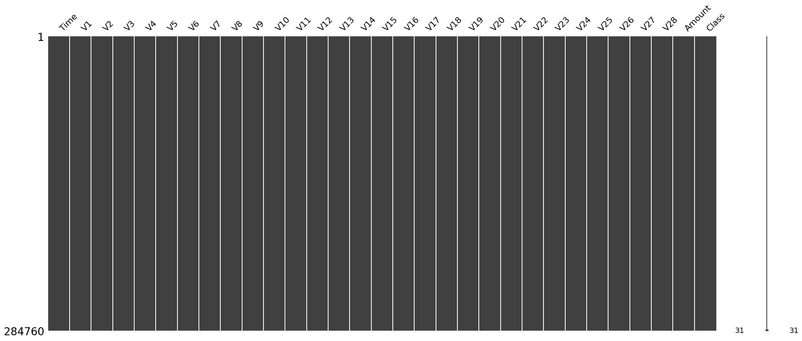
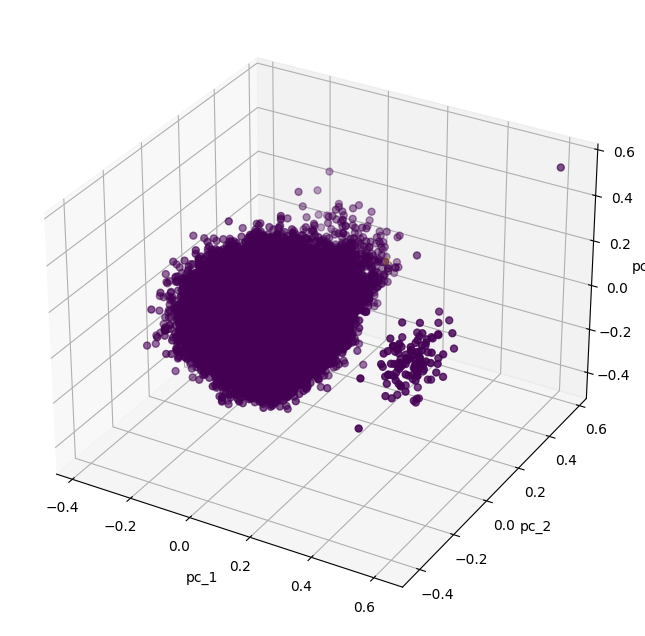
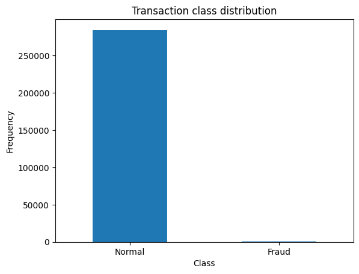
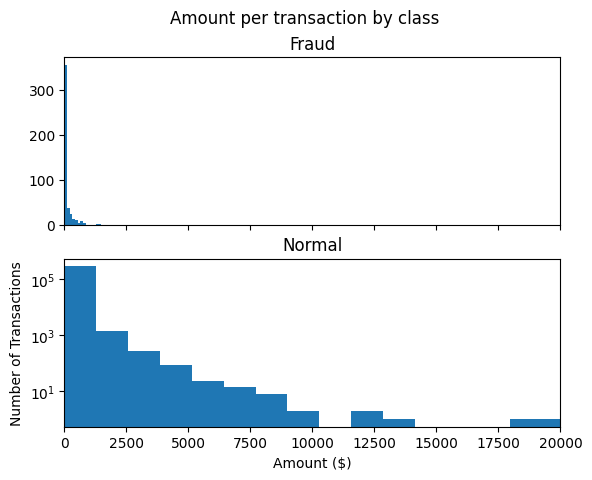
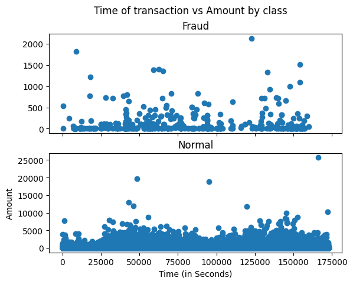

```python
# 이 Lab 시나리오는 크레딧 카드 이상거래 탐지에 autoencoder 모델, oracle 벡터쿼리를 사용하여 사기거래 탐지를 다루는 시나리오임.
# keras, oracle23ai를 기반으로함.
# python & pip 라이브러리 임포트.

import matplotlib.pyplot as plt
import pandas as pd
import numpy as np
import keras
from sklearn import datasets, decomposition, preprocessing, model_selection
from sklearn.model_selection import train_test_split
import matplotlib.pyplot as plt
import matplotlib.lines as lines
from mpl_toolkits.mplot3d import Axes3D
import seaborn as sns
from keras import layers, activations, losses, optimizers, metrics, models
from tensorflow.keras.layers import Dense
from keras.callbacks import EarlyStopping
from keras.models import load_model, save_model
import missingno as msno
print("Complete libraries loading") 
```

    2024-12-26 09:43:52.268024: E external/local_xla/xla/stream_executor/cuda/cuda_fft.cc:485] Unable to register cuFFT factory: Attempting to register factory for plugin cuFFT when one has already been registered
    2024-12-26 09:43:52.280909: E external/local_xla/xla/stream_executor/cuda/cuda_dnn.cc:8454] Unable to register cuDNN factory: Attempting to register factory for plugin cuDNN when one has already been registered
    2024-12-26 09:43:52.284974: E external/local_xla/xla/stream_executor/cuda/cuda_blas.cc:1452] Unable to register cuBLAS factory: Attempting to register factory for plugin cuBLAS when one has already been registered
    2024-12-26 09:43:52.295474: I tensorflow/core/platform/cpu_feature_guard.cc:210] This TensorFlow binary is optimized to use available CPU instructions in performance-critical operations.
    To enable the following instructions: AVX2 FMA, in other operations, rebuild TensorFlow with the appropriate compiler flags.
    2024-12-26 09:43:53.081477: W tensorflow/compiler/tf2tensorrt/utils/py_utils.cc:38] TF-TRT Warning: Could not find TensorRT


    Complete libraries loading


```python
# 데이터 원본 둘러보기
#  creditcard.csv(https://www.kaggle.com/datasets/mlg-ulb/creditcardfraud) 데이터는 kaggle에서 제공하는 샘플 데이터를 사용했음.
# 데이터 일부 로우는 벡터쿼리 테스트용으로 별도 분리해서 사용함.

pd.set_option('display.max_columns',None) # 전체 열 출력
#pd.set_option('display.max_rows',None) # 전체 행 출력
#pd.set_option('display.max_colwidth', None)  # 컬럼값 전체 출력

d1 = pd.read_csv('/home/dev01/labs/autoencoder/input/card/creditcard.csv', engine='python', sep = ',', decimal = '.', parse_dates=True)
print(d1)
#print("DF dataset:", df.columns)
#print(df, df.shape)

# missingnosms 데이터 셋에 결측값 확인하는데 유용함.

print("D1 dataframe shape:", d1.shape)
msno.matrix(d1)
plt.show()

```

                Time         V1         V2        V3        V4        V5  \
    0           18.0   0.247491   0.277666  1.185471 -0.092603 -1.314394   
    1           22.0  -1.946525  -0.044901 -0.405570 -1.013057  2.941968   
    2           22.0  -2.074295  -0.121482  1.322021  0.410008  0.295198   
    3           23.0   1.173285   0.353498  0.283905  1.133563 -0.172577   
    4           23.0   1.322707  -0.174041  0.434555  0.576038 -0.836758   
    ...          ...        ...        ...       ...       ...       ...   
    284755  172786.0 -11.881118  10.071785 -9.834783 -2.066656 -5.364473   
    284756  172787.0  -0.732789  -0.055080  2.035030 -0.738589  0.868229   
    284757  172788.0   1.919565  -0.301254 -3.249640 -0.557828  2.630515   
    284758  172788.0  -0.240440   0.530483  0.702510  0.689799 -0.377961   
    284759  172792.0  -0.533413  -0.189733  0.703337 -0.506271 -0.012546   
    
                  V6        V7        V8        V9       V10       V11       V12  \
    0      -0.150116 -0.946365 -1.617935  1.544071 -0.829881 -0.583200  0.524933   
    1       2.955053 -0.063063  0.855546  0.049967  0.573743 -0.081257 -0.215745   
    2      -0.959537  0.543985 -0.104627  0.475664  0.149451 -0.856566 -0.180523   
    3      -0.916054  0.369025 -0.327260 -0.246651 -0.046139 -0.143419  0.979350   
    4      -0.831083 -0.264905 -0.220982 -1.071425  0.868559 -0.641506 -0.111316   
    ...          ...       ...       ...       ...       ...       ...       ...   
    284755 -2.606837 -4.918215  7.305334  1.914428  4.356170 -1.593105  2.711941   
    284756  1.058415  0.024330  0.294869  0.584800 -0.975926 -0.150189  0.915802   
    284757  3.031260 -0.296827  0.708417  0.432454 -0.484782  0.411614  0.063119   
    284758  0.623708 -0.686180  0.679145  0.392087 -0.399126 -1.933849 -0.962886   
    284759 -0.649617  1.577006 -0.414650  0.486180 -0.915427 -1.040458 -0.031513   
    
                 V13       V14       V15       V16       V17       V18       V19  \
    0      -0.453375  0.081393  1.555204 -1.396895  0.783131  0.436621  2.177807   
    1       0.044161  0.033898  1.190718  0.578843 -0.975667  0.044063  0.488603   
    2      -0.655233 -0.279797 -0.211668 -0.333321  0.010751 -0.488473  0.505751   
    3       1.492285  0.101418  0.761478 -0.014584 -0.511640 -0.325056 -0.390934   
    4       0.361485  0.171945  0.782167 -1.355871 -0.216935  1.271765 -1.240622   
    ...          ...       ...       ...       ...       ...       ...       ...   
    284755 -0.689256  4.626942 -0.924459  1.107641  1.991691  0.510632 -0.682920   
    284756  1.214756 -0.675143  1.164931 -0.711757 -0.025693 -1.221179 -1.545556   
    284757 -0.183699 -0.510602  1.329284  0.140716  0.313502  0.395652 -0.577252   
    284758 -1.042082  0.449624  1.962563 -0.608577  0.509928  1.113981  2.897849   
    284759 -0.188093 -0.084316  0.041333 -0.302620 -0.660377  0.167430 -0.256117   
    
                 V20       V21       V22       V23       V24       V25       V26  \
    0      -0.230983  1.650180  0.200454 -0.185353  0.423073  0.820591 -0.227632   
    1      -0.216715 -0.579526 -0.799229  0.870300  0.983421  0.321201  0.149650   
    2      -0.386694 -0.403639 -0.227404  0.742435  0.398535  0.249212  0.274404   
    3       0.027878  0.067003  0.227812 -0.150487  0.435045  0.724825 -0.337082   
    4      -0.522951 -0.284376 -0.323357 -0.037710  0.347151  0.559639 -0.280158   
    ...          ...       ...       ...       ...       ...       ...       ...   
    284755  1.475829  0.213454  0.111864  1.014480 -0.509348  1.436807  0.250034   
    284756  0.059616  0.214205  0.924384  0.012463 -1.016226 -0.606624 -0.395255   
    284757  0.001396  0.232045  0.578229 -0.037501  0.640134  0.265745 -0.087371   
    284758  0.127434  0.265245  0.800049 -0.163298  0.123205 -0.569159  0.546668   
    284759  0.382948  0.261057  0.643078  0.376777  0.008797 -0.473649 -0.818267   
    
                 V27       V28  Amount  Class  
    0       0.336634  0.250475   22.75      0  
    1       0.707519  0.014600    0.89      0  
    2       0.359969  0.243232   26.43      0  
    3       0.016368  0.030041   41.88      0  
    4       0.042335  0.028822   16.00      0  
    ...          ...       ...     ...    ...  
    284755  0.943651  0.823731    0.77      0  
    284756  0.068472 -0.053527   24.79      0  
    284757  0.004455 -0.026561   67.88      0  
    284758  0.108821  0.104533   10.00      0  
    284759 -0.002415  0.013649  217.00      0  
    
    [284760 rows x 31 columns]
    D1 dataframe shape: (284760, 31)


    

    


```python
# 원본 데이터 시각화
# 원본 데이터 시각화를 위한 PCA기법 함수 생성
# PCA 시각화 기법은 차원 축소솨 변수추출의 목적으로 많이 사용되는 기법중 하나임.
# class 컬럼 값을 기준으로 데이터 분포도를 확인할 수 있게됨.

def show_pca_df(df):
    x = df[df.columns[1:31]].to_numpy()
    y = df[df.columns[30]].to_numpy()
    x = preprocessing.MinMaxScaler().fit_transform(x)
    pca = decomposition.PCA(n_components=3)
    pca_result = pca.fit_transform(x)
    print(pca.explained_variance_ratio_)
    
    pca_df = pd.DataFrame(data=pca_result, columns=['pc_1', 'pc_2', 'pc_3'])
    pca_df = pd.concat([pca_df, pd.DataFrame({'label': y})], axis=1)
    #fig = plt.figure(figsize=(8, 8))
    fig, ax = plt.subplots(ncols=1, figsize=(10, 8), subplot_kw={"projection":"3d"})
    #fig = plt.figure(figsize=(8, 8))
    #ax = fig.add_subplot(projection='3d')
    ax.set_xlabel("pc_1")
    ax.set_ylabel("pc_2")
    ax.set_zlabel("pc_3")
    ax.scatter(xs=pca_df['pc_1'], ys=pca_df['pc_2'], zs=pca_df['pc_3'], c=pca_df['label'], s=25)
    plt.show()

print("Complete PCA function loading")
```

    Complete PCA function loading


```python
# 원본 데이터 시각화
# 데이터 분산도 확인
show_pca_df(d1)
```

    [0.13069492 0.12175216 0.11646637]


    

    


```python
# 랜덤 샘플링 시각화

fraud = d1[d1.CLASS == 1]
normal = d1[d1.CLASS == 0].sample(n=fraud.size, random_state=1, axis='index')
d1 = pd.concat([normal,fraud])
#print(df.columns)
show_pca_df(d1)
```


```python
# 원본 데이터 시각화
# 이 lab이 목표로 하는 사기거래 식별 분류는 편향된 경우임을 확인할 수 있음.

LABELS = ["Normal", "Fraud"]

count_classes = pd.Series.value_counts(d1['Class'], sort = True)

count_classes.plot(kind = 'bar', rot=0)
plt.title("Transaction class distribution")
plt.xticks(range(2), LABELS)
plt.xlabel("Class")
plt.ylabel("Frequency")

```


    Text(0, 0.5, 'Frequency')


    

    


```python
# 원본 데이터 시각화
# 거래액 기준으로 정상, 비정상 거래액은 어떻게 다를까요?

fraud = d1[d1.Class == 1]
normal = d1[d1.Class == 0]
print("Frauds data  :", "shape:", fraud.shape, "rows:", len(fraud))
print("Normals data:", "shape:", normal.shape, "rows", len(normal))

f, (ax1, ax2) = plt.subplots(2, 1, sharex=True)
f.suptitle('Amount per transaction by class')

bins = 20

ax1.hist(fraud.Amount, bins = bins)
ax1.set_title('Fraud')

ax2.hist(normal.Amount, bins = bins)
ax2.set_title('Normal')

plt.xlabel('Amount ($)')
plt.ylabel('Number of Transactions')
plt.xlim((0, 20000))
plt.yscale('log')
plt.show()
```

    Frauds data  : shape: (469, 31) rows: 469
    Normals data: shape: (284291, 31) rows 284291


    

    


```python
# Time값에 대한 데이터 분포도 확인

f, (ax1, ax2) = plt.subplots(2, 1, sharex=True)
f.suptitle('Time of transaction vs Amount by class')

ax1.scatter(fraud.Time, fraud.Amount)
ax1.set_title('Fraud')

ax2.scatter(normal.Time, normal.Amount)
ax2.set_title('Normal')

plt.xlabel('Time (in Seconds)')
plt.ylabel('Amount')
plt.show()

print("Time 데이터는 feature 값으로 유용하지 않기 떄문에 모델 학습에서 제외 시킬거임.") 
```


    

    


    Time 데이터는 feature 값으로 유용하지 않기 떄문에 모델 학습에서 제외 시킬거임.


```python

```
