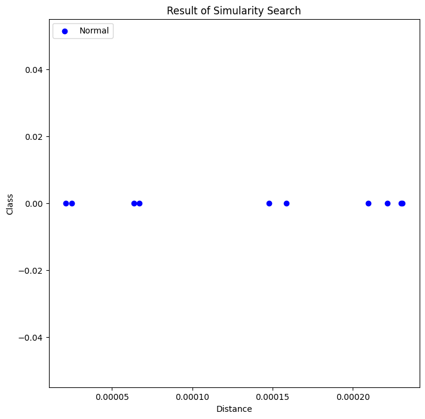
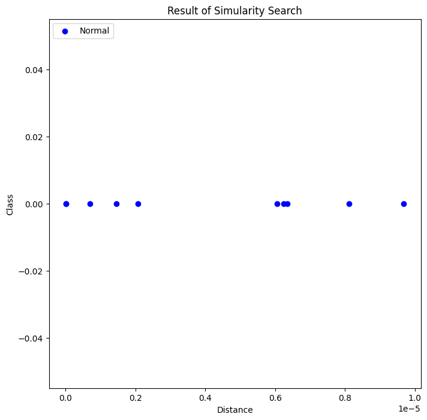
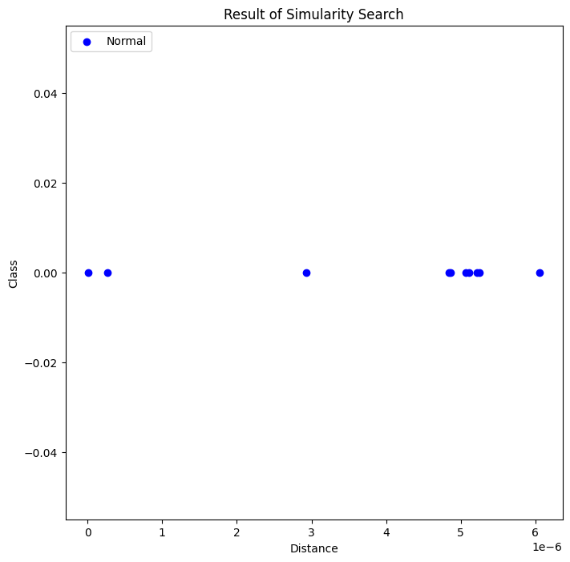
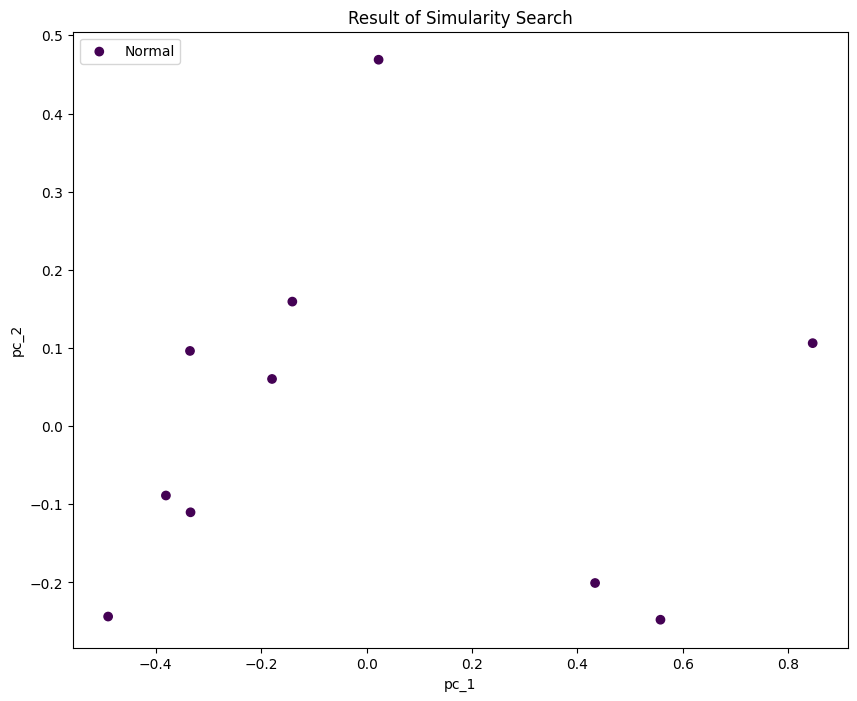
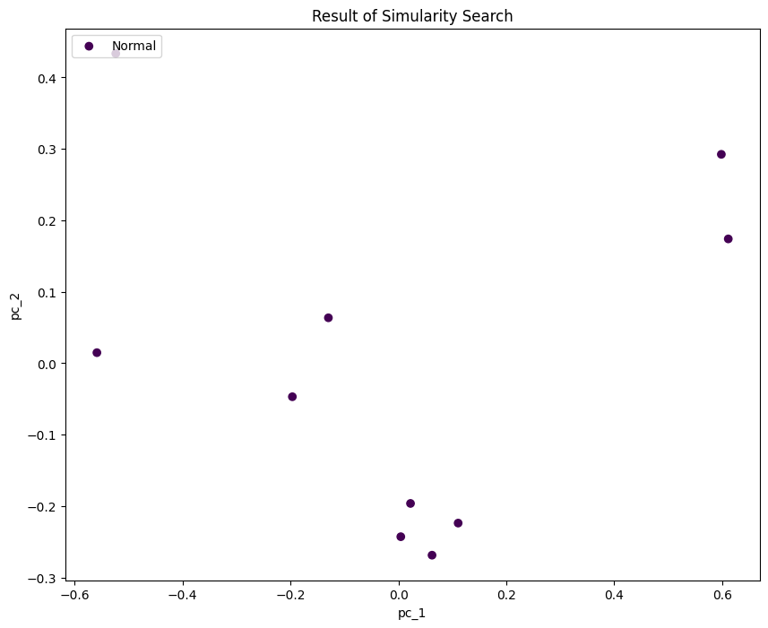
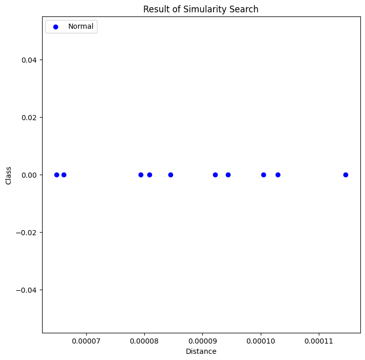
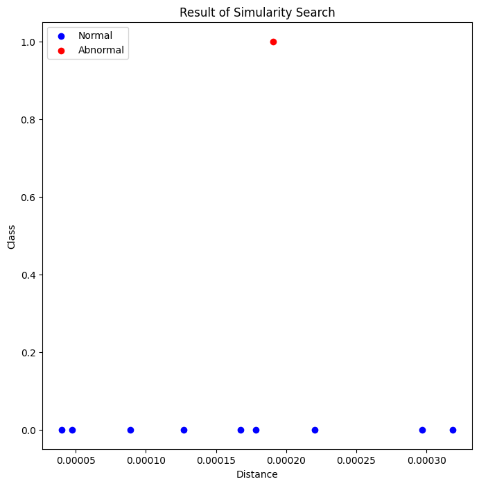
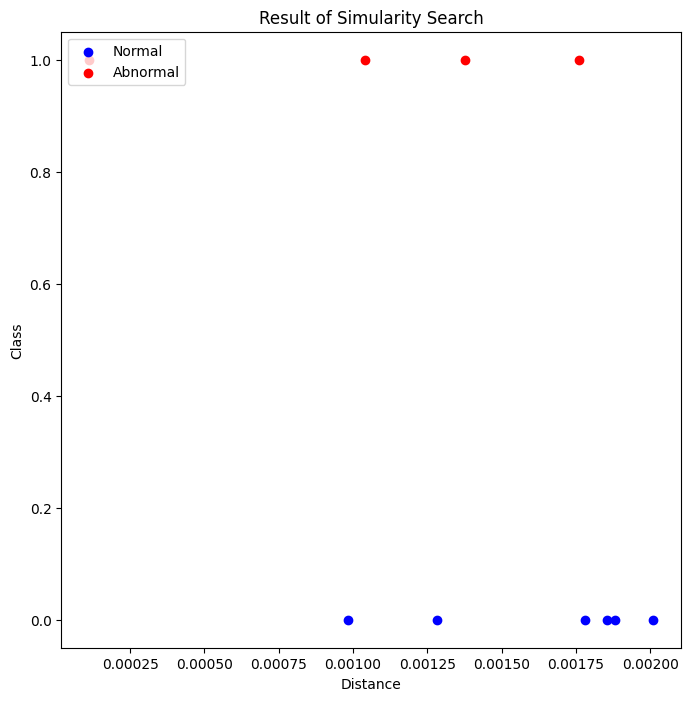

```python
# 벡터 쿼리를 통한 비정상 크래딧 카드 식별 시나리오를 다룸  
# 라이브러리 임포트, 23ai pdb 접속

import pandas as pd
import numpy as np
import keras
from keras.models import load_model, save_model
from sklearn import datasets, decomposition, preprocessing, model_selection
import matplotlib.pyplot as plt
import array
import os
import oracledb

#pd.set_option('display.max_columns',None) # 전체 열 출력
#pd.set_option('display.max_rows',None) # 전체 행 출력
pd.set_option('display.max_colwidth', None)  # 컬럼값 전체 출력

uname = "vector"
pwd = "vector"
cns = "localhost:1521/freepdb1"

oracledb.init_oracle_client()
connection = oracledb.connect(user=uname, password=pwd, dsn=cns)
cursor = connection.cursor()
print("Connected to Oracle Database 23.4")
```

    2024-12-30 08:30:08.446421: E external/local_xla/xla/stream_executor/cuda/cuda_fft.cc:485] Unable to register cuFFT factory: Attempting to register factory for plugin cuFFT when one has already been registered
    2024-12-30 08:30:08.459149: E external/local_xla/xla/stream_executor/cuda/cuda_dnn.cc:8454] Unable to register cuDNN factory: Attempting to register factory for plugin cuDNN when one has already been registered
    2024-12-30 08:30:08.463062: E external/local_xla/xla/stream_executor/cuda/cuda_blas.cc:1452] Unable to register cuBLAS factory: Attempting to register factory for plugin cuBLAS when one has already been registered
    2024-12-30 08:30:08.473294: I tensorflow/core/platform/cpu_feature_guard.cc:210] This TensorFlow binary is optimized to use available CPU instructions in performance-critical operations.
    To enable the following instructions: AVX2 FMA, in other operations, rebuild TensorFlow with the appropriate compiler flags.
    2024-12-30 08:30:09.187312: W tensorflow/compiler/tf2tensorrt/utils/py_utils.cc:38] TF-TRT Warning: Could not find TensorRT


    Connected to Oracle Database 23.4


```python
# show_fetch_simq(simq) : 벡터쿼리 결과를 데이터프레임으로 만드는 함수
# show_fetch_all(query): 쿼리 결과를 데이터프레임으로 만드는 함수  
# show_class(df) : 벡터쿼리 결과룰 2D 그래프로 표현 
# show_class_pca(df) : 벡터 쿼리 결과를 PCA 그래프로 표현

def show_fetch_simq(simq):
    cursor.execute(simq,qv=qv)
    rows = cursor.fetchall()
    col_name = cursor.description
    columns=[]
    for col in col_name:
        columns.append(col[0])
    df = pd.DataFrame(rows, columns=columns)  
    return df
    

def show_fetch_all(query):
    cursor.execute(query)
    rows = cursor.fetchall()
    col_name = cursor.description
    columns=[]
    for col in col_name:
        columns.append(col[0])
    df = pd.DataFrame(rows, columns=columns)  
    return df

def show_class(df):
    plt.figure(figsize=(8, 8))
    color = ['blue','red']  # 0(normal)=bule, 1(fraud)=red
    cluster = df.groupby('CLASS')
    for i, items in cluster:
        #print(i)
        plt.scatter('DISTANCE','CLASS', data=items, label=i,c=color[i])
    plt.title('Result of Simularity Search')
    plt.xlabel('Distance')
    plt.ylabel('Class')
    #plt.legend()
    plt.legend(['Normal', 'Abnormal'], loc='upper left')
    plt.show()

def show_class_pca(df):
    x = df[df.columns[0:2]].to_numpy()
    y = df[df.columns[2]].to_numpy()
    x = preprocessing.MinMaxScaler().fit_transform(x)
    pca = decomposition.PCA(n_components=2)
    pca_result = pca.fit_transform(x)
    #    print(pca.explained_variance_ratio_)
    #print(pca_result)    
    pca_df = pd.DataFrame(data=pca_result, columns=['pc_1', 'pc_2'])
    pca_df = pd.concat([pca_df, pd.DataFrame({'label': y})], axis=1)
    #print(pca_df)
    fig,axs = plt.subplots(ncols=1, figsize=(10, 8))
    axs.set_xlabel("pc_1")
    axs.set_ylabel("pc_2")
    axs.scatter(pca_df['pc_1'], pca_df['pc_2'], c=pca_df['label'])
    plt.title('Result of Simularity Search')
    #plt.legend(pca_df['label'])
    plt.legend(['Normal', 'Abnormal'], loc='upper left')
    #plt.legend()
    plt.show()
print("complete loading a functions ")
```

    complete loading a functions 


```python
# 입력쿼리 벡터값 조회
# 트랜젝션 입력쿼리용 벡터는 cardtr 테이블오 만들어 놓음
# class_hint = 0 is normal, 1 is fraud

qv = """select id,class,to_vector(v,5,float64) Vector from cardtr_v where class = 0 """
print("cardtr_v data")
show_fetch_all(qv)
```

    cardtr_v data


<div>
<style scoped>
    .dataframe tbody tr th:only-of-type {
        vertical-align: middle;
    }

    .dataframe tbody tr th {
        vertical-align: top;
    }

    .dataframe thead th {
        text-align: right;
    }
</style>
<table border="1" class="dataframe">
  <thead>
    <tr style="text-align: right;">
      <th></th>
      <th>ID</th>
      <th>CLASS</th>
      <th>VECTOR</th>
    </tr>
  </thead>
  <tbody>
    <tr>
      <th>0</th>
      <td>70</td>
      <td>0</td>
      <td>[0.7947559356689453, 0.18200865387916565, 0.42522022128105164, 0.5899086594581604, 0.0]</td>
    </tr>
    <tr>
      <th>1</th>
      <td>71</td>
      <td>0</td>
      <td>[1.0877034664154053, 1.2016899585723877, 1.5536125898361206, 1.2906628847122192, 0.0]</td>
    </tr>
    <tr>
      <th>2</th>
      <td>72</td>
      <td>0</td>
      <td>[1.0733181238174438, 0.8911528587341309, 1.379508137702942, 0.7536754608154297, 0.0]</td>
    </tr>
    <tr>
      <th>3</th>
      <td>73</td>
      <td>0</td>
      <td>[0.8416913747787476, 0.35536983609199524, 0.8892260193824768, 0.5480009913444519, 0.0]</td>
    </tr>
    <tr>
      <th>4</th>
      <td>74</td>
      <td>0</td>
      <td>[0.8850282430648804, 0.6655328273773193, 1.343503713607788, 0.8233135938644409, 0.0]</td>
    </tr>
  </tbody>
</table>
</div>


```python
# 크레딧카드 사기거래 탐지 벡터 쿼리
# 정상적인 거래에 대한 벡터 쿼리로써 사기 패턴과 유사한 결과는 나오지 않음
# case: class_hint = 0, id = 70

qv = '[0.7947559356689453, 0.18200865387916565, 0.42522022128105164, 0.5899086594581604, 0.0]'
simq = """ select id,vector_distance(v,to_vector(:qv,5,float64),cosine) Distance, class
         from creditcard_v
         order by vector_distance(v,to_vector(:qv,5,float64),cosine)
         fetch first 10 rows only"""
df = show_fetch_simq(simq)
print(df)
show_class(df)
#show_class_pca(df)
```

           ID  DISTANCE  CLASS
    0  242720  0.000021      0
    1  167855  0.000025      0
    2  118014  0.000064      0
    3  238757  0.000067      0
    4   93454  0.000148      0
    5  146730  0.000158      0
    6  234743  0.000210      0
    7   98032  0.000221      0
    8   54937  0.000230      0
    9  167488  0.000231      0


    

    


```python
# 크레딧카드 사기거래 탐지 벡터 쿼리
# 정상적인 거래에 대한 벡터 쿼리로써 사기 패턴과 유사한 결과는 나오지 않음
# case: class_hint = 0, id = 71

qv = '[1.0877034664154053, 1.2016899585723877, 1.5536125898361206, 1.2906628847122192, 0.0]'
simq = """ select id,vector_distance(v,to_vector(:qv,5,float64),cosine) Distance, class
         from creditcard_v
         order by vector_distance(v,to_vector(:qv,5,float64),cosine)
         fetch first 10 rows only"""
df = show_fetch_simq(simq)
print(df)
show_class(df)
#show_class_pca(df)
```

           ID      DISTANCE  CLASS
    0   47964  5.744515e-09      0
    1   18709  5.988289e-09      0
    2   17515  7.015522e-07      0
    3   37860  1.446910e-06      0
    4   46915  2.079001e-06      0
    5   37998  6.048267e-06      0
    6   15268  6.243900e-06      0
    7   25595  6.347181e-06      0
    8  255831  8.107513e-06      0
    9  268967  9.683014e-06      0


    

    


```python
# 크레딧카드 사기거래 탐지 벡터 쿼리
# 정상적인 거래에 대한 벡터 쿼리로써 사기 패턴과 유사한 결과는 나오지 않음
# case: class_hint = 0, id = 72

qv = '[1.0733181238174438, 0.8911528587341309, 1.379508137702942, 0.7536754608154297, 0.0]'
simq = """ select id,vector_distance(v,to_vector(:qv,5,float64),cosine) Distance, class
         from creditcard_v
         order by vector_distance(v,to_vector(:qv,5,float64),cosine)
         fetch first 10 rows only"""
df = show_fetch_simq(simq)
print(df)
show_class(df)
#show_class_pca(df)
```

          ID      DISTANCE  CLASS
    0  20999  5.988521e-09      0
    1  21926  2.673806e-07      0
    2  23335  2.934080e-06      0
    3  23510  4.839380e-06      0
    4  38734  4.860199e-06      0
    5  18728  5.061963e-06      0
    6  27710  5.111626e-06      0
    7  26403  5.219924e-06      0
    8    144  5.253182e-06      0
    9  26020  6.058495e-06      0


    

    


```python
# 크레딧카드 사기거래 탐지 벡터 쿼리
# 정상적인 거래에 대한 벡터 쿼리로써 사기 패턴과 유사한 결과는 나오지 않음
# case: class_hint = 0, id = 73
qv = ''
simq = """ select id,vector_distance(v,to_vector(:qv,5,float64),cosine) Distance, class
         from creditcard_v
         order by vector_distance(v,to_vector(:qv,5,float64),cosine)
         fetch first 10 rows only"""
df = show_fetch_simq(simq)
print(df)
show_class(df)
#show_class_pca(df)
```


```python
# 크레딧카드 사기거래 탐지 벡터 쿼리
# 정상적인 거래에 대한 벡터 쿼리로써 사기 패턴과 유사한 결과는 나오지 않음
# case: class_hint = 0, id = 74
qv = ''
simq = """ select id,vector_distance(v,to_vector(:qv,5,float64),cosine) Distance, class
         from creditcard_v
         order by vector_distance(v,to_vector(:qv,5,float64),cosine)
         fetch first 20 rows only"""
df = show_fetch_simq(simq)
print(df)
show_class(df)
#show_class_pca(df)
```


```python
# 입력쿼리 벡터값 조회
# 트랜젝션 입력쿼리용 벡터는 cardtr 테이블오 만들어 놓음
# class_hint = 0 is normal, 1 is fraud

qv = """select id,class,to_vector(v,5,float64) Vector from cardtr_v where class = 1 """
print("cardtr_v data")
show_fetch_all(qv)
```

    cardtr_v data


<div>
<style scoped>
    .dataframe tbody tr th:only-of-type {
        vertical-align: middle;
    }

    .dataframe tbody tr th {
        vertical-align: top;
    }

    .dataframe thead th {
        text-align: right;
    }
</style>
<table border="1" class="dataframe">
  <thead>
    <tr style="text-align: right;">
      <th></th>
      <th>ID</th>
      <th>CLASS</th>
      <th>VECTOR</th>
    </tr>
  </thead>
  <tbody>
    <tr>
      <th>0</th>
      <td>542</td>
      <td>1</td>
      <td>[1.0596373081207275, 0.921093225479126, 1.4233524799346924, 0.9470086097717285, 0.0]</td>
    </tr>
    <tr>
      <th>1</th>
      <td>624</td>
      <td>1</td>
      <td>[0.8513679504394531, 0.35227662324905396, 1.6760342121124268, 0.6925102472305298, 0.0]</td>
    </tr>
    <tr>
      <th>2</th>
      <td>4921</td>
      <td>1</td>
      <td>[1.8130626678466797, 1.4025070667266846, 1.257223129272461, 1.338057041168213, 0.0]</td>
    </tr>
    <tr>
      <th>3</th>
      <td>8313</td>
      <td>1</td>
      <td>[2.3303141593933105, 1.185705304145813, 2.2069990634918213, 0.915833592414856, 0.0]</td>
    </tr>
    <tr>
      <th>4</th>
      <td>8336</td>
      <td>1</td>
      <td>[1.9645297527313232, 0.5734691023826599, 0.03141075372695923, 0.44832921028137207, 0.0]</td>
    </tr>
  </tbody>
</table>
</div>


```python
# 크레딧카드 사기거래 탐지 벡터 쿼리
# 비정상적인 거래에 대한 벡터 쿼리로써 사기 패턴과 유사한 결과가 도출됨.
# case: clas = 1, id = 542

qv = '[1.0596373081207275, 0.921093225479126, 1.4233524799346924, 0.9470086097717285, 0.0]'
simq = """ select id,vector_distance(v,to_vector(:qv,5,float64),cosine) Distance, class
         from creditcard_v
         order by vector_distance(v,to_vector(:qv,5,float64),cosine)
         fetch first 10 rows only"""
df = show_fetch_simq(simq)
print(df)
show_class_pca(df)
#show_class(df)
```

           ID  DISTANCE  CLASS
    0  283189  0.000019      0
    1   32937  0.000023      0
    2  266394  0.000036      0
    3   39492  0.000037      0
    4  229833  0.000037      0
    5   44893  0.000041      0
    6    2417  0.000043      0
    7   33120  0.000050      0
    8   18792  0.000050      0
    9   15442  0.000058      0


    

    


```python
# 크레딧카드 사기거래 탐지 벡터 쿼리
# 비정상적인 거래에 대한 벡터 쿼리로써 사기 패턴과 유사한 결과가 도출되지 않음. 이 것은 모델의 정확도 문제임. 
# case : class = 1, id = 624

qv = '[0.8513679504394531, 0.35227662324905396, 1.6760342121124268, 0.6925102472305298, 0.0]'
simq = """ select id,vector_distance(v,to_vector(:qv,5,float64),cosine)Distance, class
         from creditcard_v
         order by vector_distance(v,to_vector(:qv,5,float64),cosine)
         fetch first 10 rows only"""
df = show_fetch_simq(simq)
print(df)
show_class_pca(df)
#show_class(df)
```

           ID  DISTANCE  CLASS
    0  164961  0.000020      0
    1  231353  0.000059      0
    2  164009  0.000099      0
    3  189603  0.000104      0
    4  180822  0.000142      0
    5  190182  0.000145      0
    6  185859  0.000154      0
    7   28270  0.000154      0
    8  172474  0.000154      0
    9   43845  0.000167      0


    

    


```python
# 크레딧카드 사기거래 탐지 벡터 쿼리
# 비정상적인 거래에 대한 벡터 쿼리로써 사기 패턴과 유사한 결과가 도출됨. 
# case : class_hint = 1, id = 4921

qv = '[1.8130626678466797, 1.4025070667266846, 1.257223129272461, 1.338057041168213, 0.0]'
simq = """ select id,vector_distance(v,to_vector(:qv,5,float64),cosine)Distance, class
         from creditcard_v
         order by vector_distance(v,to_vector(:qv,5,float64),cosine)
         fetch first 10 rows only"""
df = show_fetch_simq(simq)
#print(df)
#show_class_pca(df)
show_class(df)
```


    

    


```python
# 크레딧카드 사기거래 탐지 벡터 쿼리
# 비정상적인 거래에 대한 벡터 쿼리로써 사기 패턴과 유사한 결과가 도출됨. 
# case : class_hint = 1, id = 8313

qv = '[2.3303141593933105, 1.185705304145813, 2.2069990634918213, 0.915833592414856, 0.0]'
simq = """ select id,vector_distance(v,to_vector(:qv,5,float64),cosine)Distance, class
         from creditcard_v
         order by vector_distance(v,to_vector(:qv,5,float64),cosine)
         fetch first 10 rows only"""
df = show_fetch_simq(simq)
#print(df)
#show_class_pca(df)
show_class(df)
```


    

    


```python
# 크레딧카드 사기거래 탐지 벡터 쿼리
# 비정상적인 거래에 대한 벡터 쿼리로써 사기 패턴과 유사한 결과가 도출됨. 
# case : class_hint = 1, id = 8336

qv = '[1.9645297527313232, 0.5734691023826599, 0.03141075372695923, 0.44832921028137207, 0.0]'
simq = """ select id,vector_distance(v,to_vector(:qv,5,float64),cosine)Distance, class
         from creditcard_v
         order by vector_distance(v,to_vector(:qv,5,float64),cosine)
         fetch first 10 rows only"""
df = show_fetch_simq(simq)
#print(df)
#show_class_pca(df)
show_class(df)
```


    

    

