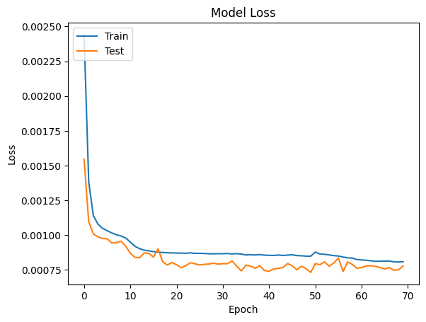
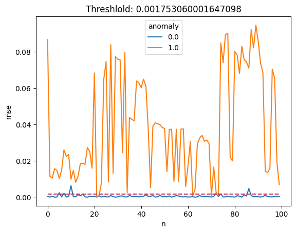

```python
# 이 Lab의 목적은 크레딧 카드 이상거래 탐지에 autoendocer 모델, 벡터쿼리를 사용하여 사기거래 탐지를 다루는 샘플임.
# 여기서는 DB 테이블 데이터에서 데이터 추출, 데이터프레임 활용한 데이터 생성, 학습 및 테스트 데이터 분류 및 scaling을 다룸.
# 아울러 autoencoding 모델를 만들고 학습, 테스트 및 모델 저장을 다룸.

import pandas as pd
import numpy as np
import keras

from keras import layers, activations, losses, optimizers, metrics, models
from keras.models import load_model, save_model
from keras.callbacks import EarlyStopping
from tensorflow.keras.layers import Dense
from sklearn import datasets, decomposition, preprocessing, model_selection
import matplotlib.pyplot as plt


import array
import os
import oracledb

#import missingno as msno

# DB 접속 및 커서 생성
uname = "vector"
pwd = "vector"
cns = "localhost:1521/freepdb1"


oracledb.init_oracle_client()
connection = oracledb.connect(user=uname, password=pwd, dsn=cns)
cursor = connection.cursor()
print("Connected to Oracle Database 23.4")

```

    2024-12-30 08:16:55.739133: E external/local_xla/xla/stream_executor/cuda/cuda_fft.cc:485] Unable to register cuFFT factory: Attempting to register factory for plugin cuFFT when one has already been registered
    2024-12-30 08:16:55.751512: E external/local_xla/xla/stream_executor/cuda/cuda_dnn.cc:8454] Unable to register cuDNN factory: Attempting to register factory for plugin cuDNN when one has already been registered
    2024-12-30 08:16:55.755569: E external/local_xla/xla/stream_executor/cuda/cuda_blas.cc:1452] Unable to register cuBLAS factory: Attempting to register factory for plugin cuBLAS when one has already been registered
    2024-12-30 08:16:55.765408: I tensorflow/core/platform/cpu_feature_guard.cc:210] This TensorFlow binary is optimized to use available CPU instructions in performance-critical operations.
    To enable the following instructions: AVX2 FMA, in other operations, rebuild TensorFlow with the appropriate compiler flags.
    2024-12-30 08:16:56.477726: W tensorflow/compiler/tf2tensorrt/utils/py_utils.cc:38] TF-TRT Warning: Could not find TensorRT


    Connected to Oracle Database 23.4


```python
# DB 테이블 데이터를 pandas 데이터 프레임으로 로딩

rows_q = """select time,v1,v2,v3,v4,v5,v6,v7,v8,v9,v10,v11,v12,v13,v14,v15,v16,v17,v18,v19,v20,
            v21,v22,v23,v24,v25,v26,v27,v28, amount, class from creditcard_v """

cursor.execute(rows_q)
rows = cursor.fetchall()

col_name = cursor.description
columns=[]
for col in col_name:
    columns.append(col[0])
#row2array = np.array(list(rows))

df = pd.DataFrame(rows, columns=columns)
#df.info()
print(" created dataframe as df")

```

     created dataframe as df


```python
# 데이터 프레임에서 학습에 불필요한 ID, TIME 컬럼 제거 
# normal 이벤트 셋과 abnormal 이벤트 셋으로 분리

x = df[df.columns[1:30]]
x = x.to_numpy()
y = df[df.columns[30]].to_numpy()
data = pd.concat([pd.DataFrame(x), pd.DataFrame({'anomaly': y})], axis=1)
data.info()

normal = data[data['anomaly'] == 0]
fraud = data[data['anomaly'] == 1]

normal_events = normal.loc[:, normal.columns != 'anomaly']
#print(normal_events)
abnormal_events = fraud.loc[:, fraud.columns != 'anomaly']

print("normal 이벤트 데이터 셋",normal_events.shape, "abnormal 이벤트 데이터셋",abnormal_events.shape)

#print("Normal_Rows:",len(normal_events), "Fraud_Rows:",len(abnormal_events))

```

    <class 'pandas.core.frame.DataFrame'>
    RangeIndex: 284797 entries, 0 to 284796
    Data columns (total 30 columns):
     #   Column   Non-Null Count   Dtype  
    ---  ------   --------------   -----  
     0   0        284797 non-null  float64
     1   1        284797 non-null  float64
     2   2        284797 non-null  float64
     3   3        284797 non-null  float64
     4   4        284797 non-null  float64
     5   5        284797 non-null  float64
     6   6        284797 non-null  float64
     7   7        284797 non-null  float64
     8   8        284797 non-null  float64
     9   9        284797 non-null  float64
     10  10       284797 non-null  float64
     11  11       284797 non-null  float64
     12  12       284797 non-null  float64
     13  13       284797 non-null  float64
     14  14       284797 non-null  float64
     15  15       284797 non-null  float64
     16  16       284797 non-null  float64
     17  17       284797 non-null  float64
     18  18       284797 non-null  float64
     19  19       284797 non-null  float64
     20  20       284797 non-null  float64
     21  21       284797 non-null  float64
     22  22       284797 non-null  float64
     23  23       284797 non-null  float64
     24  24       284797 non-null  float64
     25  25       284797 non-null  float64
     26  26       284797 non-null  float64
     27  27       284797 non-null  float64
     28  28       284797 non-null  float64
     29  anomaly  284797 non-null  int64  
    dtypes: float64(29), int64(1)
    memory usage: 65.2 MB
    normal 이벤트 데이터 셋 (284310, 29) abnormal 이벤트 데이터셋 (487, 29)


```python
# 데이터 셋 scaling
# scaling은 데디터 전처리 과정중 하나임.
# 피처들의 데이터 값의 범위가 클 경우 모델 학습때 0으로 수렴되더나 무한 발산 현상을 예방함. 

scaler = preprocessing.MinMaxScaler()

# anomaly 컬럼값 제외하여 스케일링할 것임.

scaler.fit(normal_events)

# 학습 데이터는 "normal events" 만으로 학습을 진행할 것임.
scaled_data = scaler.transform(normal_events)
print("Sacled Data: ", scaled_data.shape)

# 모델 훈련용 데이터셋, 테스트 데이터 셋 준비
# 스케일된 데이터 셋중 80는 모델 학습용, 나머지는 테스트용으로 준비

train_data, test_data = model_selection.train_test_split(scaled_data, test_size=0.2)
print("Training data:", train_data.shape, "Testing data:", test_data.shape)

# autoencoder 모델 입력 shape 지정
n_features = scaled_data.shape[1]

print("n_features:",n_features)
print("Ready for train & test data")
```

    Sacled Data:  (284310, 29)
    Training data: (227448, 29) Testing data: (56862, 29)
    n_features: 29
    Ready for train & test data


```python
# autoencoder 모델 생성.
# 모델명 : CardFraudDector
# from keras import models, layers, activations, losses, optimizers, metrics

encoder = models.Sequential(name='encoder')
encoder.add(layer=layers.Dense(units=20, activation=activations.relu, input_shape=[n_features]))
encoder.add(layers.Dropout(0.1))
encoder.add(layer=layers.Dense(units=10, activation=activations.relu))
encoder.add(layer=layers.Dense(units=5, activation=activations.relu))
decoder = models.Sequential(name='decoder')
decoder.add(layer=layers.Dense(units=10, activation=activations.relu, input_shape=[5]))
decoder.add(layer=layers.Dense(units=20, activation=activations.relu))
decoder.add(layers.Dropout(0.1))
decoder.add(layer=layers.Dense(units=n_features, activation=activations.sigmoid))
CardFraudDector = models.Sequential([encoder, decoder])

# 모델 컴파일.
# 사용 옵티마이저 : Adam
# mean_squared_error(MSE)는 실제값과 예측값의 차이를 제곱해 평균화한 것으로 특이값이 있으면 수치가 늘어남.

CardFraudDector.compile(optimizer=optimizers.Adam(), loss="mse", metrics=[metrics.mean_squared_error])
CardFraudDector.summary()
```

    /home/dev01/Python-3.12.1/lib/python3.12/site-packages/keras/src/layers/core/dense.py:87: UserWarning: Do not pass an `input_shape`/`input_dim` argument to a layer. When using Sequential models, prefer using an `Input(shape)` object as the first layer in the model instead.
      super().__init__(activity_regularizer=activity_regularizer, **kwargs)


<pre style="white-space:pre;overflow-x:auto;line-height:normal;font-family:Menlo,'DejaVu Sans Mono',consolas,'Courier New',monospace"><span style="font-weight: bold">Model: "sequential"</span>
</pre>


<pre style="white-space:pre;overflow-x:auto;line-height:normal;font-family:Menlo,'DejaVu Sans Mono',consolas,'Courier New',monospace">┏━━━━━━━━━━━━━━━━━━━━━━━━━━━━━━━━━┳━━━━━━━━━━━━━━━━━━━━━━━━┳━━━━━━━━━━━━━━━┓
┃<span style="font-weight: bold"> Layer (type)                    </span>┃<span style="font-weight: bold"> Output Shape           </span>┃<span style="font-weight: bold">       Param # </span>┃
┡━━━━━━━━━━━━━━━━━━━━━━━━━━━━━━━━━╇━━━━━━━━━━━━━━━━━━━━━━━━╇━━━━━━━━━━━━━━━┩
│ encoder (<span style="color: #0087ff; text-decoration-color: #0087ff">Sequential</span>)            │ (<span style="color: #00d7ff; text-decoration-color: #00d7ff">None</span>, <span style="color: #00af00; text-decoration-color: #00af00">5</span>)              │           <span style="color: #00af00; text-decoration-color: #00af00">865</span> │
├─────────────────────────────────┼────────────────────────┼───────────────┤
│ decoder (<span style="color: #0087ff; text-decoration-color: #0087ff">Sequential</span>)            │ (<span style="color: #00d7ff; text-decoration-color: #00d7ff">None</span>, <span style="color: #00af00; text-decoration-color: #00af00">29</span>)             │           <span style="color: #00af00; text-decoration-color: #00af00">889</span> │
└─────────────────────────────────┴────────────────────────┴───────────────┘
</pre>


<pre style="white-space:pre;overflow-x:auto;line-height:normal;font-family:Menlo,'DejaVu Sans Mono',consolas,'Courier New',monospace"><span style="font-weight: bold"> Total params: </span><span style="color: #00af00; text-decoration-color: #00af00">1,754</span> (6.85 KB)
</pre>


<pre style="white-space:pre;overflow-x:auto;line-height:normal;font-family:Menlo,'DejaVu Sans Mono',consolas,'Courier New',monospace"><span style="font-weight: bold"> Trainable params: </span><span style="color: #00af00; text-decoration-color: #00af00">1,754</span> (6.85 KB)
</pre>


<pre style="white-space:pre;overflow-x:auto;line-height:normal;font-family:Menlo,'DejaVu Sans Mono',consolas,'Courier New',monospace"><span style="font-weight: bold"> Non-trainable params: </span><span style="color: #00af00; text-decoration-color: #00af00">0</span> (0.00 B)
</pre>


```python
# 모델 훈련
# 모델 과적합 학습 방지 위한 EarlyStopping 학습 방법 사용

es = EarlyStopping(monitor='val_loss', min_delta=0.00001, patience=20, restore_best_weights=True)
history = CardFraudDector.fit(
    x=train_data, 
    y=train_data, 
    epochs=100, 
    verbose=1, 
    validation_data=[test_data, test_data], 
    callbacks=[es])

print("Complete model training")
```

    Epoch 1/100
    7108/7108 ━━━━━━━━━━━━━━━━━━━━ 10s 1ms/step - loss: 0.0048 - mean_squared_error: 0.0048 - val_loss: 0.0015 - val_mean_squared_error: 0.0015
    Epoch 2/100
    7108/7108 ━━━━━━━━━━━━━━━━━━━━ 9s 1ms/step - loss: 0.0015 - mean_squared_error: 0.0015 - val_loss: 0.0011 - val_mean_squared_error: 0.0011
    Epoch 3/100
    7108/7108 ━━━━━━━━━━━━━━━━━━━━ 9s 1ms/step - loss: 0.0012 - mean_squared_error: 0.0012 - val_loss: 0.0010 - val_mean_squared_error: 0.0010
    Epoch 4/100
    7108/7108 ━━━━━━━━━━━━━━━━━━━━ 9s 1ms/step - loss: 0.0011 - mean_squared_error: 0.0011 - val_loss: 9.8737e-04 - val_mean_squared_error: 9.8737e-04
    Epoch 5/100
    7108/7108 ━━━━━━━━━━━━━━━━━━━━ 9s 1ms/step - loss: 0.0011 - mean_squared_error: 0.0011 - val_loss: 9.7565e-04 - val_mean_squared_error: 9.7565e-04
    Epoch 6/100
    7108/7108 ━━━━━━━━━━━━━━━━━━━━ 9s 1ms/step - loss: 0.0010 - mean_squared_error: 0.0010 - val_loss: 9.7334e-04 - val_mean_squared_error: 9.7334e-04
    Epoch 7/100
    7108/7108 ━━━━━━━━━━━━━━━━━━━━ 9s 1ms/step - loss: 0.0010 - mean_squared_error: 0.0010 - val_loss: 9.4283e-04 - val_mean_squared_error: 9.4283e-04
    Epoch 8/100
    7108/7108 ━━━━━━━━━━━━━━━━━━━━ 9s 1ms/step - loss: 0.0010 - mean_squared_error: 0.0010 - val_loss: 9.4616e-04 - val_mean_squared_error: 9.4616e-04
    Epoch 9/100
    7108/7108 ━━━━━━━━━━━━━━━━━━━━ 9s 1ms/step - loss: 9.9720e-04 - mean_squared_error: 9.9720e-04 - val_loss: 9.5587e-04 - val_mean_squared_error: 9.5587e-04
    Epoch 10/100
    7108/7108 ━━━━━━━━━━━━━━━━━━━━ 9s 1ms/step - loss: 9.8754e-04 - mean_squared_error: 9.8754e-04 - val_loss: 9.2006e-04 - val_mean_squared_error: 9.2006e-04
    Epoch 11/100
    7108/7108 ━━━━━━━━━━━━━━━━━━━━ 9s 1ms/step - loss: 9.6610e-04 - mean_squared_error: 9.6610e-04 - val_loss: 8.7000e-04 - val_mean_squared_error: 8.7000e-04
    Epoch 12/100
    7108/7108 ━━━━━━━━━━━━━━━━━━━━ 9s 1ms/step - loss: 9.2315e-04 - mean_squared_error: 9.2315e-04 - val_loss: 8.4037e-04 - val_mean_squared_error: 8.4037e-04
    Epoch 13/100
    7108/7108 ━━━━━━━━━━━━━━━━━━━━ 9s 1ms/step - loss: 9.1304e-04 - mean_squared_error: 9.1304e-04 - val_loss: 8.3795e-04 - val_mean_squared_error: 8.3795e-04
    Epoch 14/100
    7108/7108 ━━━━━━━━━━━━━━━━━━━━ 9s 1ms/step - loss: 8.9203e-04 - mean_squared_error: 8.9203e-04 - val_loss: 8.7185e-04 - val_mean_squared_error: 8.7185e-04
    Epoch 15/100
    7108/7108 ━━━━━━━━━━━━━━━━━━━━ 9s 1ms/step - loss: 8.9265e-04 - mean_squared_error: 8.9265e-04 - val_loss: 8.6970e-04 - val_mean_squared_error: 8.6970e-04
    Epoch 16/100
    7108/7108 ━━━━━━━━━━━━━━━━━━━━ 9s 1ms/step - loss: 8.7997e-04 - mean_squared_error: 8.7997e-04 - val_loss: 8.4171e-04 - val_mean_squared_error: 8.4171e-04
    Epoch 17/100
    7108/7108 ━━━━━━━━━━━━━━━━━━━━ 9s 1ms/step - loss: 8.8061e-04 - mean_squared_error: 8.8061e-04 - val_loss: 9.0213e-04 - val_mean_squared_error: 9.0213e-04
    Epoch 18/100
    7108/7108 ━━━━━━━━━━━━━━━━━━━━ 9s 1ms/step - loss: 8.7698e-04 - mean_squared_error: 8.7698e-04 - val_loss: 8.0821e-04 - val_mean_squared_error: 8.0821e-04
    Epoch 19/100
    7108/7108 ━━━━━━━━━━━━━━━━━━━━ 9s 1ms/step - loss: 8.7320e-04 - mean_squared_error: 8.7320e-04 - val_loss: 7.8486e-04 - val_mean_squared_error: 7.8486e-04
    Epoch 20/100
    7108/7108 ━━━━━━━━━━━━━━━━━━━━ 9s 1ms/step - loss: 8.7223e-04 - mean_squared_error: 8.7223e-04 - val_loss: 8.0390e-04 - val_mean_squared_error: 8.0390e-04
    Epoch 21/100
    7108/7108 ━━━━━━━━━━━━━━━━━━━━ 9s 1ms/step - loss: 8.7278e-04 - mean_squared_error: 8.7278e-04 - val_loss: 7.8673e-04 - val_mean_squared_error: 7.8673e-04
    Epoch 22/100
    7108/7108 ━━━━━━━━━━━━━━━━━━━━ 9s 1ms/step - loss: 8.7140e-04 - mean_squared_error: 8.7140e-04 - val_loss: 7.6541e-04 - val_mean_squared_error: 7.6541e-04
    Epoch 23/100
    7108/7108 ━━━━━━━━━━━━━━━━━━━━ 9s 1ms/step - loss: 8.6839e-04 - mean_squared_error: 8.6839e-04 - val_loss: 7.8076e-04 - val_mean_squared_error: 7.8076e-04
    Epoch 24/100
    7108/7108 ━━━━━━━━━━━━━━━━━━━━ 9s 1ms/step - loss: 8.7096e-04 - mean_squared_error: 8.7096e-04 - val_loss: 8.0121e-04 - val_mean_squared_error: 8.0121e-04
    Epoch 25/100
    7108/7108 ━━━━━━━━━━━━━━━━━━━━ 9s 1ms/step - loss: 8.7205e-04 - mean_squared_error: 8.7205e-04 - val_loss: 7.9370e-04 - val_mean_squared_error: 7.9370e-04
    Epoch 26/100
    7108/7108 ━━━━━━━━━━━━━━━━━━━━ 9s 1ms/step - loss: 8.6852e-04 - mean_squared_error: 8.6852e-04 - val_loss: 7.8586e-04 - val_mean_squared_error: 7.8586e-04
    Epoch 27/100
    7108/7108 ━━━━━━━━━━━━━━━━━━━━ 9s 1ms/step - loss: 8.6427e-04 - mean_squared_error: 8.6427e-04 - val_loss: 7.8978e-04 - val_mean_squared_error: 7.8978e-04
    Epoch 28/100
    7108/7108 ━━━━━━━━━━━━━━━━━━━━ 9s 1ms/step - loss: 8.6511e-04 - mean_squared_error: 8.6511e-04 - val_loss: 7.9204e-04 - val_mean_squared_error: 7.9204e-04
    Epoch 29/100
    7108/7108 ━━━━━━━━━━━━━━━━━━━━ 9s 1ms/step - loss: 8.6621e-04 - mean_squared_error: 8.6621e-04 - val_loss: 7.9834e-04 - val_mean_squared_error: 7.9834e-04
    Epoch 30/100
    7108/7108 ━━━━━━━━━━━━━━━━━━━━ 9s 1ms/step - loss: 8.6581e-04 - mean_squared_error: 8.6581e-04 - val_loss: 7.9129e-04 - val_mean_squared_error: 7.9129e-04
    Epoch 31/100
    7108/7108 ━━━━━━━━━━━━━━━━━━━━ 9s 1ms/step - loss: 8.6454e-04 - mean_squared_error: 8.6454e-04 - val_loss: 7.9504e-04 - val_mean_squared_error: 7.9504e-04
    Epoch 32/100
    7108/7108 ━━━━━━━━━━━━━━━━━━━━ 9s 1ms/step - loss: 8.6084e-04 - mean_squared_error: 8.6084e-04 - val_loss: 7.9428e-04 - val_mean_squared_error: 7.9428e-04
    Epoch 33/100
    7108/7108 ━━━━━━━━━━━━━━━━━━━━ 9s 1ms/step - loss: 8.6455e-04 - mean_squared_error: 8.6455e-04 - val_loss: 8.1412e-04 - val_mean_squared_error: 8.1412e-04
    Epoch 34/100
    7108/7108 ━━━━━━━━━━━━━━━━━━━━ 9s 1ms/step - loss: 8.6884e-04 - mean_squared_error: 8.6884e-04 - val_loss: 7.7707e-04 - val_mean_squared_error: 7.7707e-04
    Epoch 35/100
    7108/7108 ━━━━━━━━━━━━━━━━━━━━ 9s 1ms/step - loss: 8.6842e-04 - mean_squared_error: 8.6842e-04 - val_loss: 7.4270e-04 - val_mean_squared_error: 7.4270e-04
    Epoch 36/100
    7108/7108 ━━━━━━━━━━━━━━━━━━━━ 9s 1ms/step - loss: 8.6038e-04 - mean_squared_error: 8.6038e-04 - val_loss: 7.8381e-04 - val_mean_squared_error: 7.8381e-04
    Epoch 37/100
    7108/7108 ━━━━━━━━━━━━━━━━━━━━ 9s 1ms/step - loss: 8.5873e-04 - mean_squared_error: 8.5873e-04 - val_loss: 7.7729e-04 - val_mean_squared_error: 7.7729e-04
    Epoch 38/100
    7108/7108 ━━━━━━━━━━━━━━━━━━━━ 9s 1ms/step - loss: 8.5441e-04 - mean_squared_error: 8.5441e-04 - val_loss: 7.6173e-04 - val_mean_squared_error: 7.6173e-04
    Epoch 39/100
    7108/7108 ━━━━━━━━━━━━━━━━━━━━ 9s 1ms/step - loss: 8.6767e-04 - mean_squared_error: 8.6767e-04 - val_loss: 7.7997e-04 - val_mean_squared_error: 7.7997e-04
    Epoch 40/100
    7108/7108 ━━━━━━━━━━━━━━━━━━━━ 9s 1ms/step - loss: 8.5531e-04 - mean_squared_error: 8.5531e-04 - val_loss: 7.4537e-04 - val_mean_squared_error: 7.4537e-04
    Epoch 41/100
    7108/7108 ━━━━━━━━━━━━━━━━━━━━ 9s 1ms/step - loss: 8.5430e-04 - mean_squared_error: 8.5430e-04 - val_loss: 7.4071e-04 - val_mean_squared_error: 7.4071e-04
    Epoch 42/100
    7108/7108 ━━━━━━━━━━━━━━━━━━━━ 9s 1ms/step - loss: 8.5691e-04 - mean_squared_error: 8.5691e-04 - val_loss: 7.5669e-04 - val_mean_squared_error: 7.5669e-04
    Epoch 43/100
    7108/7108 ━━━━━━━━━━━━━━━━━━━━ 9s 1ms/step - loss: 8.5716e-04 - mean_squared_error: 8.5716e-04 - val_loss: 7.6112e-04 - val_mean_squared_error: 7.6112e-04
    Epoch 44/100
    7108/7108 ━━━━━━━━━━━━━━━━━━━━ 9s 1ms/step - loss: 8.5554e-04 - mean_squared_error: 8.5554e-04 - val_loss: 7.6672e-04 - val_mean_squared_error: 7.6672e-04
    Epoch 45/100
    7108/7108 ━━━━━━━━━━━━━━━━━━━━ 9s 1ms/step - loss: 8.5741e-04 - mean_squared_error: 8.5741e-04 - val_loss: 7.9572e-04 - val_mean_squared_error: 7.9572e-04
    Epoch 46/100
    7108/7108 ━━━━━━━━━━━━━━━━━━━━ 9s 1ms/step - loss: 8.5960e-04 - mean_squared_error: 8.5960e-04 - val_loss: 7.7961e-04 - val_mean_squared_error: 7.7961e-04
    Epoch 47/100
    7108/7108 ━━━━━━━━━━━━━━━━━━━━ 9s 1ms/step - loss: 8.5149e-04 - mean_squared_error: 8.5149e-04 - val_loss: 7.5143e-04 - val_mean_squared_error: 7.5143e-04
    Epoch 48/100
    7108/7108 ━━━━━━━━━━━━━━━━━━━━ 9s 1ms/step - loss: 8.4783e-04 - mean_squared_error: 8.4783e-04 - val_loss: 7.7624e-04 - val_mean_squared_error: 7.7624e-04
    Epoch 49/100
    7108/7108 ━━━━━━━━━━━━━━━━━━━━ 9s 1ms/step - loss: 8.5141e-04 - mean_squared_error: 8.5141e-04 - val_loss: 7.5853e-04 - val_mean_squared_error: 7.5853e-04
    Epoch 50/100
    7108/7108 ━━━━━━━━━━━━━━━━━━━━ 9s 1ms/step - loss: 8.4459e-04 - mean_squared_error: 8.4459e-04 - val_loss: 7.3195e-04 - val_mean_squared_error: 7.3195e-04
    Epoch 51/100
    7108/7108 ━━━━━━━━━━━━━━━━━━━━ 9s 1ms/step - loss: 8.7710e-04 - mean_squared_error: 8.7710e-04 - val_loss: 7.9493e-04 - val_mean_squared_error: 7.9493e-04
    Epoch 52/100
    7108/7108 ━━━━━━━━━━━━━━━━━━━━ 9s 1ms/step - loss: 8.6712e-04 - mean_squared_error: 8.6712e-04 - val_loss: 7.8731e-04 - val_mean_squared_error: 7.8731e-04
    Epoch 53/100
    7108/7108 ━━━━━━━━━━━━━━━━━━━━ 9s 1ms/step - loss: 8.5971e-04 - mean_squared_error: 8.5971e-04 - val_loss: 8.0766e-04 - val_mean_squared_error: 8.0766e-04
    Epoch 54/100
    7108/7108 ━━━━━━━━━━━━━━━━━━━━ 9s 1ms/step - loss: 8.6446e-04 - mean_squared_error: 8.6446e-04 - val_loss: 7.7652e-04 - val_mean_squared_error: 7.7652e-04
    Epoch 55/100
    7108/7108 ━━━━━━━━━━━━━━━━━━━━ 9s 1ms/step - loss: 8.5184e-04 - mean_squared_error: 8.5184e-04 - val_loss: 8.0067e-04 - val_mean_squared_error: 8.0067e-04
    Epoch 56/100
    7108/7108 ━━━━━━━━━━━━━━━━━━━━ 9s 1ms/step - loss: 8.4912e-04 - mean_squared_error: 8.4912e-04 - val_loss: 8.3517e-04 - val_mean_squared_error: 8.3517e-04
    Epoch 57/100
    7108/7108 ━━━━━━━━━━━━━━━━━━━━ 9s 1ms/step - loss: 8.4735e-04 - mean_squared_error: 8.4735e-04 - val_loss: 7.3895e-04 - val_mean_squared_error: 7.3895e-04
    Epoch 58/100
    7108/7108 ━━━━━━━━━━━━━━━━━━━━ 9s 1ms/step - loss: 8.3448e-04 - mean_squared_error: 8.3448e-04 - val_loss: 8.0721e-04 - val_mean_squared_error: 8.0721e-04
    Epoch 59/100
    7108/7108 ━━━━━━━━━━━━━━━━━━━━ 9s 1ms/step - loss: 8.3847e-04 - mean_squared_error: 8.3847e-04 - val_loss: 7.8960e-04 - val_mean_squared_error: 7.8960e-04
    Epoch 60/100
    7108/7108 ━━━━━━━━━━━━━━━━━━━━ 9s 1ms/step - loss: 8.2731e-04 - mean_squared_error: 8.2731e-04 - val_loss: 7.6201e-04 - val_mean_squared_error: 7.6201e-04
    Epoch 61/100
    7108/7108 ━━━━━━━━━━━━━━━━━━━━ 9s 1ms/step - loss: 8.1600e-04 - mean_squared_error: 8.1600e-04 - val_loss: 7.6667e-04 - val_mean_squared_error: 7.6667e-04
    Epoch 62/100
    7108/7108 ━━━━━━━━━━━━━━━━━━━━ 9s 1ms/step - loss: 8.1739e-04 - mean_squared_error: 8.1739e-04 - val_loss: 7.7812e-04 - val_mean_squared_error: 7.7812e-04
    Epoch 63/100
    7108/7108 ━━━━━━━━━━━━━━━━━━━━ 9s 1ms/step - loss: 8.1818e-04 - mean_squared_error: 8.1818e-04 - val_loss: 7.7975e-04 - val_mean_squared_error: 7.7975e-04
    Epoch 64/100
    7108/7108 ━━━━━━━━━━━━━━━━━━━━ 9s 1ms/step - loss: 8.0974e-04 - mean_squared_error: 8.0974e-04 - val_loss: 7.7540e-04 - val_mean_squared_error: 7.7540e-04
    Epoch 65/100
    7108/7108 ━━━━━━━━━━━━━━━━━━━━ 9s 1ms/step - loss: 8.1617e-04 - mean_squared_error: 8.1617e-04 - val_loss: 7.6719e-04 - val_mean_squared_error: 7.6719e-04
    Epoch 66/100
    7108/7108 ━━━━━━━━━━━━━━━━━━━━ 9s 1ms/step - loss: 8.0834e-04 - mean_squared_error: 8.0834e-04 - val_loss: 7.5584e-04 - val_mean_squared_error: 7.5584e-04
    Epoch 67/100
    7108/7108 ━━━━━━━━━━━━━━━━━━━━ 9s 1ms/step - loss: 8.1464e-04 - mean_squared_error: 8.1464e-04 - val_loss: 7.6677e-04 - val_mean_squared_error: 7.6677e-04
    Epoch 68/100
    7108/7108 ━━━━━━━━━━━━━━━━━━━━ 9s 1ms/step - loss: 8.1004e-04 - mean_squared_error: 8.1004e-04 - val_loss: 7.4731e-04 - val_mean_squared_error: 7.4731e-04
    Epoch 69/100
    7108/7108 ━━━━━━━━━━━━━━━━━━━━ 9s 1ms/step - loss: 8.0273e-04 - mean_squared_error: 8.0273e-04 - val_loss: 7.5138e-04 - val_mean_squared_error: 7.5138e-04
    Epoch 70/100
    7108/7108 ━━━━━━━━━━━━━━━━━━━━ 9s 1ms/step - loss: 8.1193e-04 - mean_squared_error: 8.1193e-04 - val_loss: 7.7869e-04 - val_mean_squared_error: 7.7869e-04
    Complete model training


```python
# 모델 훈련 결과 시각화
plt.plot(history.history['loss'])
plt.plot(history.history['val_loss'])
plt.title('Model Loss')
plt.ylabel('Loss')
plt.xlabel('Epoch')
plt.legend(['Train', 'Test'], loc='upper left')
plt.show()

```


    

    


```python
# keras 모델 저장

CardFraudDector.save('./binds/creditcard-abnormal-model-db.keras')
#CardFraudDector.save_weights('./binds/creditcard-abnormal-model-db.weights.h5')
print("CardFraudDector model saved")
```

    CardFraudDector model saved


```python
# 모델 예측 정확도 계산
CardFraudDector.compile(optimizer=optimizers.Adam(), loss="mse", metrics=['accuracy'])
loss, accuracy = CardFraudDector.evaluate(train_data,train_data)

print("Accuracy : ", accuracy * 100 , "Loss : ", loss * 100)

```

    7108/7108 ━━━━━━━━━━━━━━━━━━━━ 4s 608us/step - accuracy: 0.9908 - loss: 7.3574e-04
    Accuracy :  99.06747937202454 Loss :  0.0731786887627095

#load Model
CardFraudDector = load_model('./binds/CreditCardtr-anonym.keras', compile=False)
print("Loaded CardFraudDector model")

```python
# 출력 예측값을 기반으로 한 cut off 값 계산
train_predicted_x = CardFraudDector.predict(x=train_data)
train_events_mse = losses.mean_squared_error(train_data, train_predicted_x)
cut_off = np.percentile(train_events_mse, 95)
print('cut_off:', cut_off)
# cut_off: 0.0018044193333480501
```

    7108/7108 ━━━━━━━━━━━━━━━━━━━━ 4s 612us/step
    cut_off: 0.001753060001647098


```python
# 모델 평가 
import seaborn as sns
import matplotlib.lines as lines


plot_samples = 100
# normal event
real_x = test_data[:plot_samples].reshape(plot_samples, n_features)
predicted_x = CardFraudDector.predict(x=real_x)
#print("Test data Predict", predicted_x)
normal_events_mse = losses.mean_squared_error(real_x, predicted_x)
normal_events_df = pd.DataFrame({'mse': normal_events_mse,'n': np.arange(0, plot_samples),'anomaly': np.zeros(plot_samples)})

# abnormal event
abnormal_x = scaler.transform(abnormal_events)[:plot_samples].reshape(plot_samples, n_features)
predicted_x = CardFraudDector.predict(x=abnormal_x)
#print("abnormal_x predict", predicted_x)
abnormal_events_mse = losses.mean_squared_error(abnormal_x, predicted_x)
abnormal_events_df = pd.DataFrame({'mse': abnormal_events_mse,'n': np.arange(0, plot_samples),'anomaly': np.ones(plot_samples)})

mse_df = pd.concat([normal_events_df, abnormal_events_df])
plot = sns.lineplot(x=mse_df.n, y=mse_df.mse, hue=mse_df.anomaly)

line = lines.Line2D(
	xdata=np.arange(0, plot_samples),
	ydata=np.full(plot_samples, cut_off),
	color='#CC2B5E',
	linewidth=1.5,
	linestyle='dashed')

plot.add_artist(line)
plt.title('Threshlold: {threshold}'.format(threshold=cut_off))
plt.show()
```

    4/4 ━━━━━━━━━━━━━━━━━━━━ 0s 1ms/step 
    4/4 ━━━━━━━━━━━━━━━━━━━━ 0s 1ms/step 


    

    


```python
# 참고 자료
https://docs.oracle.com/en/database/oracle/oracle-database/23/vecse/
https://towardsdatascience.com/applying-anomaly-detection-with-autoencoders-to-fraud-detection-feaaee6b5b09
https://venelinvalkov.medium.com/credit-card-fraud-detection-using-autoencoders-in-keras-tensorflow-for-hackers-part-vii-20e0c85301bd
```
