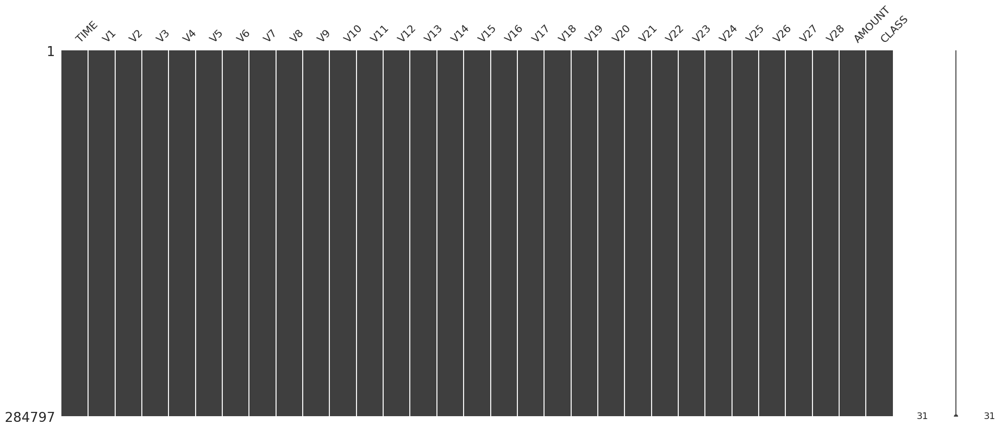
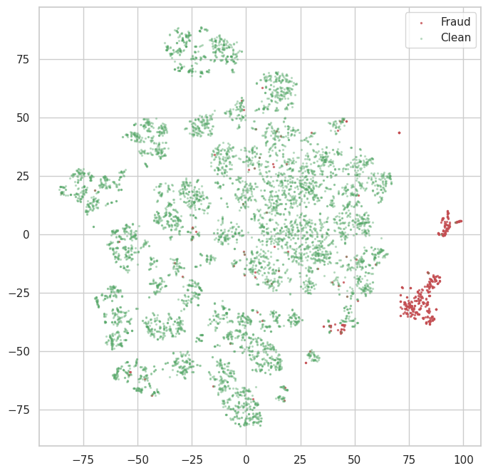

```python
# 23ai 테이블 데이터를 활용한 데이터 탐색 예제

import pandas as pd
import numpy as np
import keras

from keras import layers, activations, losses, optimizers, metrics, models
from keras.models import load_model, save_model
from keras.callbacks import EarlyStopping
from tensorflow.keras.layers import Dense

from sklearn import datasets, decomposition, preprocessing, model_selection
from sklearn.model_selection import train_test_split
import matplotlib.pyplot as plt
import matplotlib.lines as lines
import tensorflow as tf
import seaborn as sns
from mpl_toolkits.mplot3d import Axes3D

import missingno as msno

import pandas as pd
import array
import os
import oracledb

# misc
import random as rn

sns.set(style='whitegrid', context='notebook')

# DB 접속 및 커서 생성
uname = "vector"
pwd = "vector"
cns = "localhost:1521/freepdb1"

oracledb.init_oracle_client()
connection = oracledb.connect(user=uname, password=pwd, dsn=cns)
cursor = connection.cursor()
print("Connected to Oracle Database 23.4")

```

    2024-12-31 09:32:41.646716: E external/local_xla/xla/stream_executor/cuda/cuda_fft.cc:485] Unable to register cuFFT factory: Attempting to register factory for plugin cuFFT when one has already been registered
    2024-12-31 09:32:41.659638: E external/local_xla/xla/stream_executor/cuda/cuda_dnn.cc:8454] Unable to register cuDNN factory: Attempting to register factory for plugin cuDNN when one has already been registered
    2024-12-31 09:32:41.663708: E external/local_xla/xla/stream_executor/cuda/cuda_blas.cc:1452] Unable to register cuBLAS factory: Attempting to register factory for plugin cuBLAS when one has already been registered
    2024-12-31 09:32:41.673866: I tensorflow/core/platform/cpu_feature_guard.cc:210] This TensorFlow binary is optimized to use available CPU instructions in performance-critical operations.
    To enable the following instructions: AVX2 FMA, in other operations, rebuild TensorFlow with the appropriate compiler flags.
    2024-12-31 09:32:42.384611: W tensorflow/compiler/tf2tensorrt/utils/py_utils.cc:38] TF-TRT Warning: Could not find TensorRT


    Connected to Oracle Database 23.4


```python
# DB 테이블 쿼리 후 panas 데이터프레임 만들기
# 데이터프레임을 시각화 하기
#prepare data form oracle db table
#row_cnt = """ select count(*) from test_card"""

#prepare data form oracle db table(view)

#rownum = 1
rows_q = """select time,v1,v2,v3,v4,v5,v6,v7,v8,v9,v10,v11,v12,v13,v14,v15,v16,v17,v18,v19,v20,
            v21,v22,v23,v24,v25,v26,v27,v28, amount, class from creditcard_v """

cursor.execute(rows_q)
rows = cursor.fetchall()

col_name = cursor.description
columns=[]
for col in col_name:
    columns.append(col[0])
row2array = np.array(list(rows))

df = pd.DataFrame(row2array, columns=columns)

fraud = df[df.CLASS == 1]
normal = df[df.CLASS == 0]
print("Entire Rows =",df.shape, "Fraud rows(Value=1) =",fraud.shape,"Normal rows(Value=0) =",normal.shape)

msno.matrix(df)
plt.show()
```

    Entire Rows = (284797, 31) Fraud rows(Value=1) = (487, 31) Normal rows(Value=0) = (284310, 31)


    

    


```python
# manual parameters
RANDOM_SEED = 42
TRAINING_SAMPLE = 200000
VALIDATE_SIZE = 0.2

# setting random seeds for libraries to ensure reproducibility
np.random.seed(RANDOM_SEED)
rn.seed(RANDOM_SEED)
tf.random.set_seed(RANDOM_SEED)
```


```python
# let's quickly convert the columns to lower case and rename the Class column 
# so as to not cause syntax errors
df.columns = map(str.lower, df.columns)
df.rename(columns={'class': 'label'}, inplace=True)

# print first 5 rows to get an initial impression of the data we're dealing with
df.head()
```


<div>
<style scoped>
    .dataframe tbody tr th:only-of-type {
        vertical-align: middle;
    }

    .dataframe tbody tr th {
        vertical-align: top;
    }

    .dataframe thead th {
        text-align: right;
    }
</style>
<table border="1" class="dataframe">
  <thead>
    <tr style="text-align: right;">
      <th></th>
      <th>time</th>
      <th>v1</th>
      <th>v2</th>
      <th>v3</th>
      <th>v4</th>
      <th>v5</th>
      <th>v6</th>
      <th>v7</th>
      <th>v8</th>
      <th>v9</th>
      <th>...</th>
      <th>v21</th>
      <th>v22</th>
      <th>v23</th>
      <th>v24</th>
      <th>v25</th>
      <th>v26</th>
      <th>v27</th>
      <th>v28</th>
      <th>amount</th>
      <th>label</th>
    </tr>
  </thead>
  <tbody>
    <tr>
      <th>0</th>
      <td>49.0</td>
      <td>1.098608</td>
      <td>0.202424</td>
      <td>0.525456</td>
      <td>1.323436</td>
      <td>-0.130486</td>
      <td>0.039924</td>
      <td>0.028379</td>
      <td>0.072841</td>
      <td>-0.097869</td>
      <td>...</td>
      <td>-0.024972</td>
      <td>0.154264</td>
      <td>-0.063147</td>
      <td>0.253205</td>
      <td>0.629405</td>
      <td>-0.345345</td>
      <td>0.040469</td>
      <td>0.010264</td>
      <td>13.18</td>
      <td>0.0</td>
    </tr>
    <tr>
      <th>1</th>
      <td>49.0</td>
      <td>-0.549626</td>
      <td>0.418949</td>
      <td>1.729833</td>
      <td>0.203065</td>
      <td>-0.187012</td>
      <td>0.253878</td>
      <td>0.500894</td>
      <td>0.251256</td>
      <td>-0.227985</td>
      <td>...</td>
      <td>0.115062</td>
      <td>0.418529</td>
      <td>-0.065133</td>
      <td>0.264981</td>
      <td>0.003958</td>
      <td>0.395969</td>
      <td>0.027182</td>
      <td>0.043506</td>
      <td>59.99</td>
      <td>0.0</td>
    </tr>
    <tr>
      <th>2</th>
      <td>49.0</td>
      <td>0.921544</td>
      <td>-0.067084</td>
      <td>0.077461</td>
      <td>0.953638</td>
      <td>0.067412</td>
      <td>0.016152</td>
      <td>0.320452</td>
      <td>0.038534</td>
      <td>-0.391513</td>
      <td>...</td>
      <td>-0.333930</td>
      <td>-1.299920</td>
      <td>0.084311</td>
      <td>-0.370398</td>
      <td>0.155102</td>
      <td>-0.834490</td>
      <td>0.000909</td>
      <td>0.035547</td>
      <td>135.51</td>
      <td>0.0</td>
    </tr>
    <tr>
      <th>3</th>
      <td>50.0</td>
      <td>-0.671709</td>
      <td>0.594503</td>
      <td>0.216416</td>
      <td>-0.867311</td>
      <td>2.966908</td>
      <td>3.632495</td>
      <td>0.563295</td>
      <td>0.673026</td>
      <td>-0.188766</td>
      <td>...</td>
      <td>-0.136441</td>
      <td>-0.300362</td>
      <td>-0.331692</td>
      <td>0.996382</td>
      <td>0.502469</td>
      <td>-0.518043</td>
      <td>-0.208276</td>
      <td>-0.116048</td>
      <td>14.80</td>
      <td>0.0</td>
    </tr>
    <tr>
      <th>4</th>
      <td>51.0</td>
      <td>1.259873</td>
      <td>0.254240</td>
      <td>0.514789</td>
      <td>0.620924</td>
      <td>-0.475930</td>
      <td>-0.992286</td>
      <td>0.066417</td>
      <td>-0.209275</td>
      <td>0.035572</td>
      <td>...</td>
      <td>-0.256531</td>
      <td>-0.739212</td>
      <td>0.135732</td>
      <td>0.381990</td>
      <td>0.219302</td>
      <td>0.094291</td>
      <td>-0.028687</td>
      <td>0.019198</td>
      <td>1.98</td>
      <td>0.0</td>
    </tr>
  </tbody>
</table>
<p>5 rows × 31 columns</p>
</div>


```python
# add a negligible amount to avoid taking the log of 0
df['log10_amount'] = np.log10(df.amount + 0.00001)
# keep the label field at the back
df = df[
    [col for col in df if col not in ['label', 'log10_amount']] + 
    ['log10_amount', 'label']
]
```


```python
# manual parameter 
RATIO_TO_FRAUD = 15

# dropping redundant columns
df = df.drop(['time', 'amount'], axis=1)

# splitting by class
fraud = df[df.label == 1]
clean = df[df.label == 0]

# undersample clean transactions
clean_undersampled = clean.sample(
    int(len(fraud) * RATIO_TO_FRAUD),
    random_state=RANDOM_SEED
)

# concatenate with fraud transactions into a single dataframe
visualisation_initial = pd.concat([fraud, clean_undersampled])
column_names = list(visualisation_initial.drop('label', axis=1).columns)

# isolate features from labels 
features, labels = visualisation_initial.drop('label', axis=1).values, \
                   visualisation_initial.label.values

print(f"""The non-fraud dataset has been undersampled from {len(clean):,} to {len(clean_undersampled):,}.
This represents a ratio of {RATIO_TO_FRAUD}:1 to fraud.""")
```

    The non-fraud dataset has been undersampled from 284,310 to 7,305.
    This represents a ratio of 15:1 to fraud.


```python
# t_SNE output
from sklearn.manifold import TSNE
from mpl_toolkits.mplot3d import Axes3D

def tsne_scatter(features, labels, dimensions=2, save_as='graph.png'):
    if dimensions not in (2, 3):
        raise ValueError('tsne_scatter can only plot in 2d or 3d (What are you? An alien that can visualise >3d?). Make sure the "dimensions" argument is in (2, 3)')

    # t-SNE dimensionality reduction
    features_embedded = TSNE(n_components=dimensions, random_state=RANDOM_SEED).fit_transform(features)
    
    # initialising the plot
    fig, ax = plt.subplots(figsize=(8,8))
    
    # counting dimensions
    if dimensions == 3: ax = fig.add_subplot(111, projection='3d')

    # plotting data
    ax.scatter(
        *zip(*features_embedded[np.where(labels==1)]),
        marker='o',
        color='r',
        s=2,
        alpha=0.7,
        label='Fraud'
    )
    ax.scatter(
        *zip(*features_embedded[np.where(labels==0)]),
        marker='o',
        color='g',
        s=2,
        alpha=0.3,
        label='Clean'
    )

    # storing it to be displayed later
    plt.legend(loc='best')
    plt.savefig(save_as);
    plt.show;

```


    

    


```python
tsne_scatter(features, labels, dimensions=2, save_as='tsne_initial_2d.png')
```


```python
참고자료
https://www.kaggle.com/code/robinteuwens/anomaly-detection-with-auto-encoders
```
