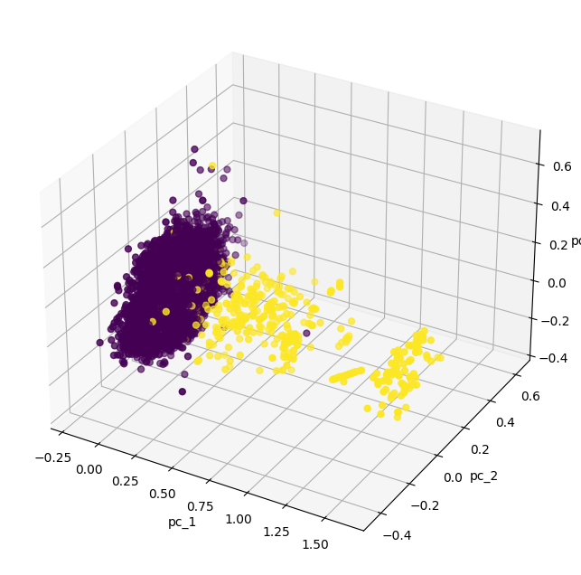

```python
# 23ai 테이블 데이터를 활용한 데이터 탐색 시나리오

import pandas as pd
import numpy as np
import keras

from keras import layers, activations, losses, optimizers, metrics, models
from keras.models import load_model, save_model
from keras.callbacks import EarlyStopping
from tensorflow.keras.layers import Dense

from sklearn import datasets, decomposition, preprocessing, model_selection
from sklearn.model_selection import train_test_split
import matplotlib.pyplot as plt
import matplotlib.lines as lines
from mpl_toolkits.mplot3d import Axes3D

import seaborn as sns
import missingno as msno

import pandas as pd
import array
import os
import oracledb

# DB 접속 및 커서 생성
uname = "vector"
pwd = "vector"
cns = "localhost:1521/freepdb1"

oracledb.init_oracle_client()
connection = oracledb.connect(user=uname, password=pwd, dsn=cns)
cursor = connection.cursor()
print("Connected to Oracle Database 23.4")

```

    Connected to Oracle Database 23.4


```python
# DB 테이블 쿼리 후 panas 데이터프레임 만들기
# 데이터프레임을 시각화 하기
#prepare data form oracle db table
#row_cnt = """ select count(*) from test_card"""

#prepare data form oracle db table(view)

#rownum = 1
rows_q = """select time,v1,v2,v3,v4,v5,v6,v7,v8,v9,v10,v11,v12,v13,v14,v15,v16,v17,v18,v19,v20,
            v21,v22,v23,v24,v25,v26,v27,v28, amount, class from creditcard_v """

cursor.execute(rows_q)
rows = cursor.fetchall()

col_name = cursor.description
columns=[]
for col in col_name:
    columns.append(col[0])
row2array = np.array(list(rows))

df = pd.DataFrame(row2array, columns=columns)

fraud = df[df.CLASS == 1]
normal = df[df.CLASS == 0]
print("Entire Rows =",df.shape, "Fraud rows(Value=1) =",fraud.shape,"Normal rows(Value=0) =",normal.shape)

msno.matrix(df)
plt.show()
```

    Entire Rows = (284750, 31) Fraud rows(Value=1) = (464, 31) Normal rows(Value=0) = (284286, 31)


    

    


```python
# explolering a data 
LABELS = ["Normal", "Fraud"]

count_classes = pd.Series.value_counts(df['CLASS'], sort = True)

count_classes.plot(kind = 'bar', rot=0)
plt.title("Transaction class distribution")
plt.xticks(range(2), LABELS)
plt.xlabel("Class")
plt.ylabel("Frequency")

```


    Text(0, 0.5, 'Frequency')


    

    


```python
# function for visualized dataset
def show_pca_df(df):
    x = df[df.columns[1:30]].to_numpy()
    y = df[df.columns[30]].to_numpy()
    x = preprocessing.MinMaxScaler().fit_transform(x)
    pca = decomposition.PCA(n_components=3)
    pca_result = pca.fit_transform(x)
    print(pca.explained_variance_ratio_)
    
    pca_df = pd.DataFrame(data=pca_result, columns=['pc_1', 'pc_2', 'pc_3'])
    pca_df = pd.concat([pca_df, pd.DataFrame({'label': y})], axis=1)
    fig = plt.figure(figsize=(8, 8))
    #fig, axs = plt.subplots(ncols=1, figsize=(10, 8), subplot_kw={"projection":"3d"})
    fig = plt.figure(figsize=(8, 8))
    ax = fig.add_subplot(projection='3d')
    ax.set_xlabel("pc_1")
    ax.set_ylabel("pc_2")
    ax.set_zlabel("pc_3")
    ax.scatter(xs=pca_df['pc_1'], ys=pca_df['pc_2'], zs=pca_df['pc_3'], c=pca_df['label'], s=25)
    plt.show()

# review for data distribution
show_pca_df(df)
```

    [0.13506324 0.12582369 0.12035863]


    <Figure size 800x800 with 0 Axes>


    

    


```python
# review for anomaly

fraud = df[df.CLASS == 1]
normal = df[df.CLASS == 0].sample(n=fraud.size, random_state=1, axis='index')
df = pd.concat([normal,fraud])
#print(df.columns)
show_pca_df(df)
```

    [0.22060688 0.10199725 0.09767194]


    <Figure size 800x800 with 0 Axes>


    

    


```python
# 원본 데이터 시각화
# 거래액 기준으로 정상, 비정상 거래액은 어떻게 다를까요?

fraud = df[df.CLASS == 1]
normal = df[df.CLASS == 0]
print("Frauds data  :", "shape:", fraud.shape, "rows:", len(fraud))
print("Normals data:", "shape:", normal.shape, "rows", len(normal))

f, (ax1, ax2) = plt.subplots(2, 1, sharex=True)
f.suptitle('Amount per transaction by class')

bins = 20

ax1.hist(fraud.AMOUNT, bins = bins)
ax1.set_title('Fraud')

ax2.hist(normal.AMOUNT, bins = bins)
ax2.set_title('Normal')

plt.xlabel('Amount ($)')
plt.ylabel('Number of Transactions')
plt.xlim((0, 20000))
plt.yscale('log')
plt.show()
```

    Frauds data  : shape: (464, 31) rows: 464
    Normals data: shape: (14384, 31) rows 14384


    

    


```python
# Time값에 대한 데이터 분포도 확인

f, (ax1, ax2) = plt.subplots(2, 1, sharex=True)
f.suptitle('Time of transaction vs Amount by class')

ax1.scatter(fraud.TIME, fraud.AMOUNT)
ax1.set_title('Fraud')

ax2.scatter(normal.TIME, normal.AMOUNT)
ax2.set_title('Normal')

plt.xlabel('Time (in Seconds)')
plt.ylabel('Amount')
plt.show()

print("Time 데이터는 feature 값으로 유용하지 않기 떄문에 모델 학습에서 제외 시킬거임.") 
```


    

    


    Time 데이터는 feature 값으로 유용하지 않기 떄문에 모델 학습에서 제외 시킬거임.


